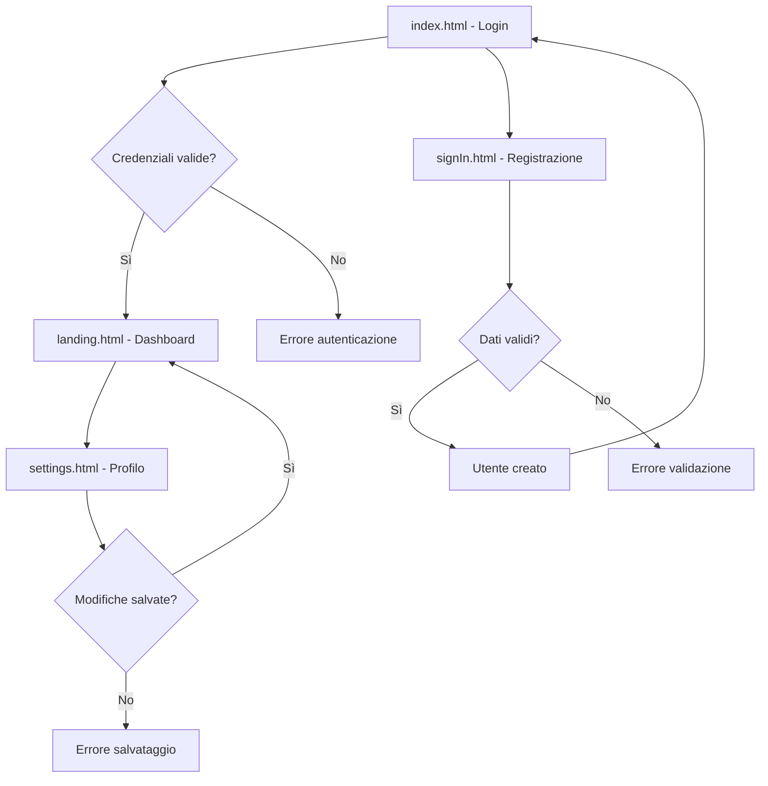

# Sistema di Gestione Utenti Web

> **Applicazione web completa per la gestione di utenti con autenticazione sicura e interfaccia responsive**

---

## 🎯 **Descrizione del Progetto**

### **Scopo dell'Applicazione**
Sistema web completo per la gestione utenti che permette:
- **Registrazione** di nuovi utenti con validazione sicura
- **Autenticazione** tramite username e password
- **Gestione profilo** con modifica dati personali
- **Navigazione protetta** tra le sezioni dell'applicazione
- **Persistenza dati** tra sessioni di utilizzo

### **Tecnologie Implementate**
- **Frontend**: HTML5, CSS3, JavaScript ES6 Modules
- **UI Framework**: Bootstrap 5 per design responsive
- **Storage**: localStorage/sessionStorage per persistenza dati
- **Sicurezza**: Web Crypto API per hashing SHA-256 delle password
- **Architettura**: Design modulare con separazione delle responsabilità

---

## 🏗️ **Architettura dell'Applicazione**

### **Struttura del Progetto**
```
user-database/
├── index.html                    # 🏠 Pagina principale di login
├── myStyle.css                   # 🎨 Stili personalizzati
├── js/                          # 🧠 Logica applicazione
│   ├── usersManagement.js       # 👥 Gestione utenti e autenticazione
│   ├── validate.js              # ✅ Validazione input con feedback visivo
│   ├── errorsManagement.js      # 🚨 Sistema di gestione errori
│   └── pages-scripts/           # 📄 Script specifici per pagina
│       ├── login.js             # 🔐 Logica pagina di login
│       ├── singin.js            # 📝 Logica pagina registrazione
│       ├── landing.js           # 🏠 Logica dashboard utente
│       └── modif.js             # ⚙️ Logica modifica profilo
└── pages/                       # 🌐 Pagine dell'applicazione
    ├── signIn.html              # 📝 Interfaccia registrazione
    ├── landing.html             # 🏠 Dashboard utente
    └── settings.html           # ⚙️ Modifica profilo
```

### **Flusso dell'Applicazione**



#### **1. Separazione delle Responsabilità**
```javascript
// 🧠 Business Logic (usersManagement.js)
export function updateUserEmail(newEmail) {
    // Logica pura senza dipendenze UI
    return updateUserData("email", newEmail);
}

// 🎨 UI Logic (modif.js)
try {
    updateUserEmail(newEmail);
    alert("Email aggiornata con successo!");
} catch (error) {
    handleUserError(error); // Gestione centralizzata
}
```

#### **2. Error Handling Centralizzato**
```javascript
// 🚨 Sistema errori tipizzati
class UserManagementError extends Error {
    constructor(type, message, details = null) {
        this.type = type;        // 'VALIDATION', 'STORAGE', 'NOT_FOUND'
        this.message = message;
        this.details = details;
        this.timestamp = new Date().toISOString();
    }
}

// 🎯 Handler centralizzato
function handleUserError(error) {
    switch(error.type) {
        case 'VALIDATION': alert(`Errore di validazione: ${error.message}`); break;
        case 'STORAGE': alert(`Errore di storage: ${error.message}`); break;
        case 'AUTH': alert(`Errore di autenticazione: ${error.message}`); break;
        default: alert(`Errore: ${error.message}`);
    }
}
```

#### **3. Pattern DRY (Don't Repeat Yourself)**
```javascript
// 🔄 Funzione generica per aggiornamenti utente
async function updateUserData(field, newValue, needsPreprocessing = null) {
    const processedValue = needsPreprocessing ? await hashString(newValue) : newValue;
    const users = retrieveRegisteredUsers();
    const userIndex = users.findIndex(user => user.id === getLoggedUserId());
    
    if (userIndex === -1) throw new UserManagementError("NOT_FOUND", "Utente non trovato");
    
    users[userIndex][field] = processedValue;
    updateUsersDB(users);
}

// 🎯 Specializzazioni specifiche
export function updateUserUsername(newUsername) {
    return updateUserData("username", newUsername);
}

export async function updateUserPassword(newPassword) {
    return updateUserData("password", newPassword, true); // true = applica hashing
}
```

---

## 🚀 **Funzionalità dell'Applicazione**

### **1. Registrazione Utenti**

#### **Processo di Registrazione**
1. **Accesso alla pagina**: L'utente naviga su `signIn.html`
2. **Inserimento dati**: Compilazione form con username, email, password
3. **Validazione real-time**: Controllo immediato della validità dei dati inseriti
4. **Verifica unicità**: Controllo che username ed email non siano già in uso
5. **Creazione account**: Salvataggio sicuro con password hashata
6. **Conferma**: Messaggio di successo e redirect al login

#### **Validazione Avanzata**
```javascript
// Validazione password in tempo reale
export function validatePassword(inputObject) {
    const password = inputObject.DOMelement.value;
    
    // Requisiti di sicurezza
    const hasUpperCase = /[A-Z]/.test(password);
    const hasLowerCase = /[a-z]/.test(password);
    const hasNumbers = /[0-9]/.test(password);
    const hasMinLength = password.length >= 8;
    
    // Feedback visivo immediato per ogni requisito
    updateIndicator("upCase", hasUpperCase);
    updateIndicator("lowCase", hasLowerCase);
    updateIndicator("num", hasNumbers);
    updateIndicator("passLen", hasMinLength);
}
```

**Caratteristiche della validazione:**
- ✅ **Feedback immediato** durante la digitazione
- ✅ **Indicatori visivi** per ogni requisito di password
- ✅ **Controllo unicità** username ed email
- ✅ **Validazione email** con pattern regex avanzato

### **2. Sistema di Autenticazione**

#### **Processo di Login**
1. **Inserimento credenziali**: Username e password
2. **Ricerca utente**: Verifica esistenza username nel database
3. **Verifica password**: Confronto hash per sicurezza
4. **Gestione sessione**: Salvataggio stato utente loggato
5. **Accesso**: Redirect alla dashboard personalizzata

#### **Sicurezza Implementata**
```javascript
// Processo di autenticazione sicuro
try {
    const user = searchUserbyName(username);                  // Trova utente
    const authenticated = await admitUser(user.id, password); // Verifica password hash
    
    if (authenticated) {
        updateLoggedUser(user.id);                            // Salva sessione
        window.location.href = "./pages/landing.html";       // Accesso garantito
    } else {
        alert("Password errata");                             // Feedback errore
    }
} catch (error) {
    handleUserError(error);                                   // Gestione errori
}
```

**Caratteristiche di sicurezza:**
- 🔒 **Hashing SHA-256** delle password (mai salvate in chiaro)
- 🔒 **Gestione sessioni** con sessionStorage
- 🔒 **Protezione pagine** con controllo autenticazione
- 🔒 **Error handling** che non rivela informazioni sensibili

### **3. Dashboard Utente**

#### **Funzionalità della Landing Page**
- **Controllo accesso**: Verifica automatica autenticazione
- **Personalizzazione**: Interfaccia adattata all'utente loggato
- **Navigazione**: Accesso alle funzioni di gestione profilo
- **Sicurezza**: Logout automatico per sessioni non valide

### **4. Gestione Profilo Utente**

#### **Modifica Dati Personali**
L'utente può aggiornare:
- ✏️ **Username** (con controllo unicità)
- ✏️ **Email** (con controllo unicità e validazione formato)
- ✏️ **Password** (con hashing automatico)

#### **Processo di Modifica**
1. **Abilitazione campi**: L'utente seleziona i dati da modificare
2. **Validazione input**: Controllo real-time della validità
3. **Verifica disponibilità**: Controllo unicità per username/email
4. **Salvataggio atomico**: Aggiornamento sicuro del profilo
5. **Feedback**: Conferma delle modifiche effettuate

```javascript
// Aggiornamento sicuro del profilo
if (modifEmailInput.DOMelement.required) {
    try {
        authEmail(newEmail);                    // Verifica disponibilità
        updateUserEmail(newEmail);              // Aggiornamento atomico
        alert("Email aggiornata con successo");
    } catch (error) {
        handleUserError(error);                 // Gestione errori
    }
}
```

---

## 🔒 **Sicurezza e Gestione Dati**

### **Protezione delle Password**
- **Hashing SHA-256**: Ogni password viene convertita in hash crittografico
- **Nessun salvataggio in chiaro**: Le password originali non vengono mai memorizzate
- **Confronto sicuro**: L'autenticazione avviene confrontando hash, non testo in chiaro
- **Salt automatico**: Timestamp utilizzato per unicità degli hash

### **Gestione Storage**
- **localStorage**: Persistenza dei dati utente tra sessioni
- **sessionStorage**: Gestione dello stato di login temporaneo
- **Controlli integrità**: Validazione dei dati recuperati dallo storage
- **Gestione errori**: Fallback automatici in caso di corruzione dati

### **Validazione e Sanitizzazione**
- **Input validation**: Controllo rigoroso di tutti i dati inseriti
- **Regex patterns**: Validazione formato email e criteri password
- **Controllo unicità**: Prevenzione duplicati per username e email
- **Error masking**: I messaggi di errore non rivelano informazioni di sistema

---

## � **Interfaccia Utente e Design**

### **Design Responsive**
- **Bootstrap 5**: Framework CSS per layout adattivo
- **Mobile-first**: Ottimizzazione per dispositivi mobili
- **Feedback visivo**: Indicatori di stato per ogni interazione
- **Accessibilità**: Struttura semantica e controlli tastiera

### **User Experience**
- **Validazione real-time**: Feedback immediato durante l'inserimento
- **Indicatori di progresso**: Visualizzazione requisiti password
- **Messaggi chiari**: Comunicazione diretta degli stati dell'applicazione
- **Navigazione intuitiva**: Flusso logico tra le pagine

---

## ⚙️ **Tecnologie e Implementazione**

### **Modularità del Codice**
```javascript
// Separazione delle responsabilità
// Business Logic (usersManagement.js)
export function updateUserEmail(newEmail) {
    return updateUserData("email", newEmail);
}

// UI Logic (modif.js)
try {
    updateUserEmail(newEmail);
    alert("Email aggiornata con successo!");
} catch (error) {
    handleUserError(error);
}
```

### **Pattern Implementati**
1. **Factory Pattern**: Creazione standardizzata oggetti utente
2. **Strategy Pattern**: Validazione differenziata per tipo di input
3. **Template Method**: Processo generico per aggiornamenti dati
4. **Error Handling centralizzato**: Gestione uniforme degli errori

### **Gestione Asincrona**
```javascript
// Operazioni crittografiche asincrone
export async function hashString(originalString) {
    const data = new TextEncoder().encode(originalString);
    const hashBuffer = await crypto.subtle.digest("SHA-256", data);
    const hashArray = Array.from(new Uint8Array(hashBuffer));
    return hashArray.map(b => b.toString(16).padStart(2, "0")).join("");
}
```

### **Sistema di Errori Tipizzati**
```javascript
// Errori strutturati per migliore gestione
function UserManagementError(type, message, details = null) {
    this.name = "UserManagementError";
    this.type = type;        // 'VALIDATION', 'STORAGE', 'NOT_FOUND'
    this.message = message;
    this.details = details;
    this.timestamp = new Date().toISOString();
}

// Gestione centralizzata
function handleUserError(error) {
    switch(error.type) {
        case 'VALIDATION': alert(`Errore di validazione: ${error.message}`); break;
        case 'STORAGE': alert(`Errore di storage: ${error.message}`); break;
        case 'AUTH': alert(`Errore di autenticazione: ${error.message}`); break;
        default: alert(`Errore: ${error.message}`);
    }
}
```

---

## 📱 **Utilizzo dell'Applicazione**

### **Requisiti di Sistema**
- Browser moderno con supporto ES6 (Chrome 60+, Firefox 55+, Safari 12+)
- JavaScript abilitato
- LocalStorage supportato (disponibile in tutti i browser moderni)

### **Avvio dell'Applicazione**
1. Aprire `index.html` in un browser web
2. L'applicazione caricherà la pagina di login
3. Utilizzare il link "Registrati" per creare un nuovo account
4. Effettuare login con le credenziali create

### **Casi d'Uso Principali**
- **Nuovo utente**: Registrazione → Login → Accesso dashboard
- **Utente esistente**: Login diretto → Gestione profilo
- **Modifica profilo**: Accesso alle impostazioni → Aggiornamento dati
- **Logout**: Chiusura sicura della sessione

---

## 🔍 **Dettagli Tecnici Avanzati**

### **Gestione Stati dell'Applicazione**
L'applicazione mantiene diversi stati per garantire un'esperienza fluida:

```javascript
// Stati di validazione per feedback utente
const INPUT_STATES = {
    EMPTY: 0,      // Campo vuoto (neutro)
    VALID: 1,      // Input valido (verde)
    INVALID: -1    // Input non valido (rosso)
};

// Gestione dinamica pulsanti submit
export function validateBtn(inputFieldsArray, button) {
    const allValid = !inputFieldsArray.some(
        field => field.inputStatus !== 1 && field.DOMelement.required
    );
    button.disabled = !allValid;
}
```

### **Architettura dei Dati**
```javascript
// Struttura oggetto utente
const userObject = {
    id: "user_1703123456789_1234",    // ID univoco timestamp-based
    username: "mario",                 // Username scelto dall'utente
    email: "mario@email.com",         // Email validata
    password: "hashed_password_sha256", // Password sempre hashata
    favorites: [],                     // Array per funzionalità future
    creationDate: "2023-12-21T10:30:00.000Z" // Timestamp ISO creazione
};
```

### **Flusso di Sicurezza**
1. **Input sanitization**: Tutti gli input vengono validati prima dell'elaborazione
2. **Password hashing**: Conversione immediata in hash SHA-256
3. **Session management**: Controllo automatico dello stato di autenticazione
4. **Data integrity**: Verifica integrità dati recuperati dallo storage

---

## 🎯 **Caratteristiche Distintive**

### **Robustezza del Sistema**
- **Gestione errori completa**: Ogni operazione include handling degli errori
- **Fallback automatici**: Il sistema continua a funzionare anche con dati corrotti
- **Validazione a più livelli**: Client-side e business logic per massima sicurezza
- **Operazioni atomiche**: Prevenzione stati inconsistenti durante gli aggiornamenti

### **Esperienza Utente Ottimizzata**
- **Feedback immediato**: Validazione real-time durante la digitazione
- **Indicatori visivi**: Colori e icone per comunicare lo stato delle operazioni
- **Messaggi informativi**: Comunicazione chiara di successi ed errori
- **Design responsive**: Interfaccia adattiva per tutti i dispositivi

### **Sicurezza Avanzata**
- **Crittografia lato client**: Hashing delle password prima dell'archiviazione
- **Protezione contro injection**: Validazione e sanitizzazione degli input
- **Gestione sessioni sicura**: Controllo automatico dell'autenticazione
- **Privacy by design**: Nessun dato sensibile esposto o loggato

---

## 🚀 **Conclusioni**

Il **Sistema di Gestione Utenti Web** rappresenta un'implementazione completa e moderna di un'applicazione web per la gestione utenti. Il progetto combina:

- **Tecnologie web moderne** con approccio modulare
- **Sicurezza avanzata** con crittografia lato client
- **User experience ottimale** con validazione real-time
- **Architettura scalabile** per future estensioni

L'applicazione dimostra competenze approfondite in **JavaScript moderno**, **sicurezza web**, **design patterns** e **architettura software**, risultando in un sistema funzionale, sicuro e user-friendly.

---

*Progetto sviluppato per scopi didattici - Programmazione Web*  
*Tecnologie: HTML5, CSS3, JavaScript ES6, Bootstrap 5, Web Crypto API*
