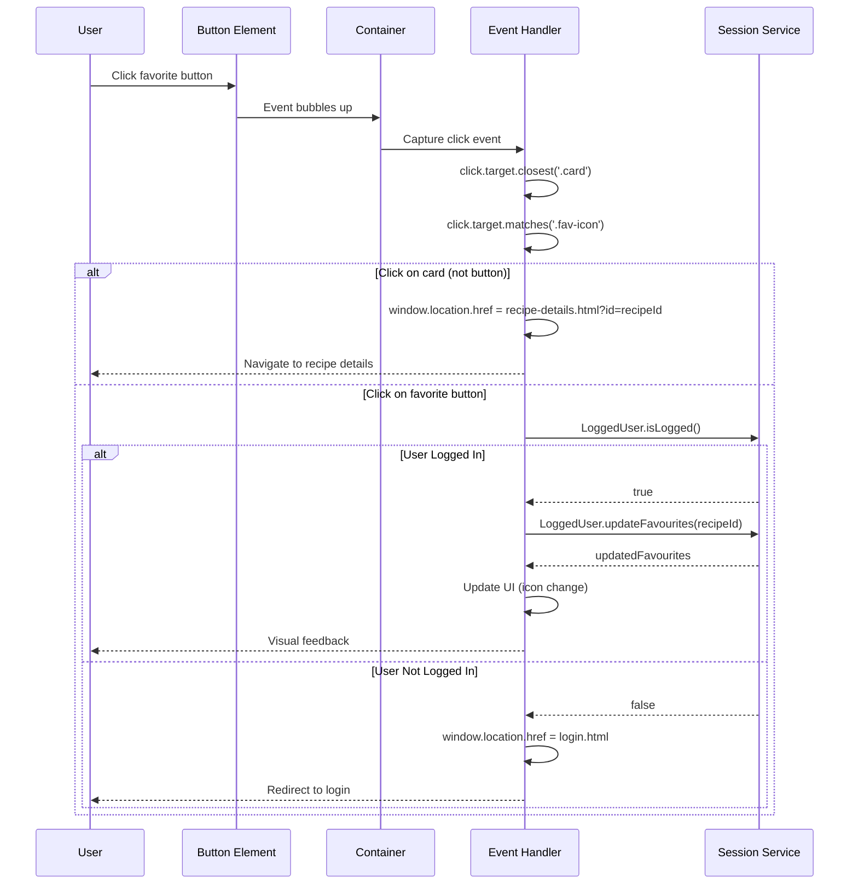
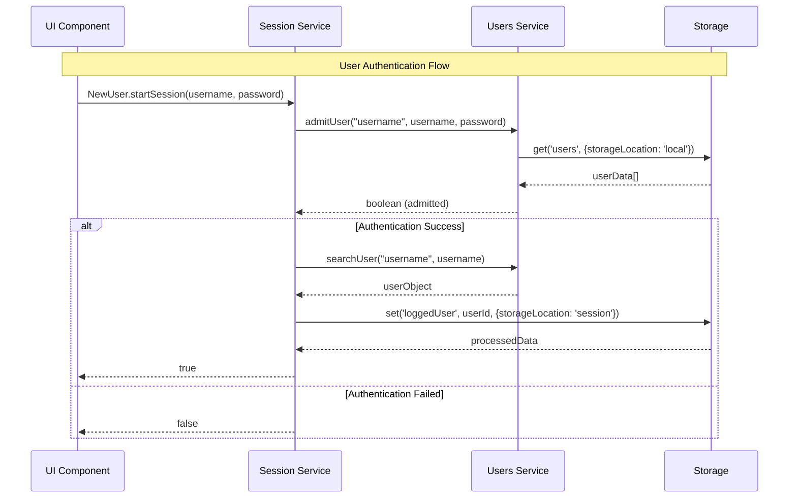
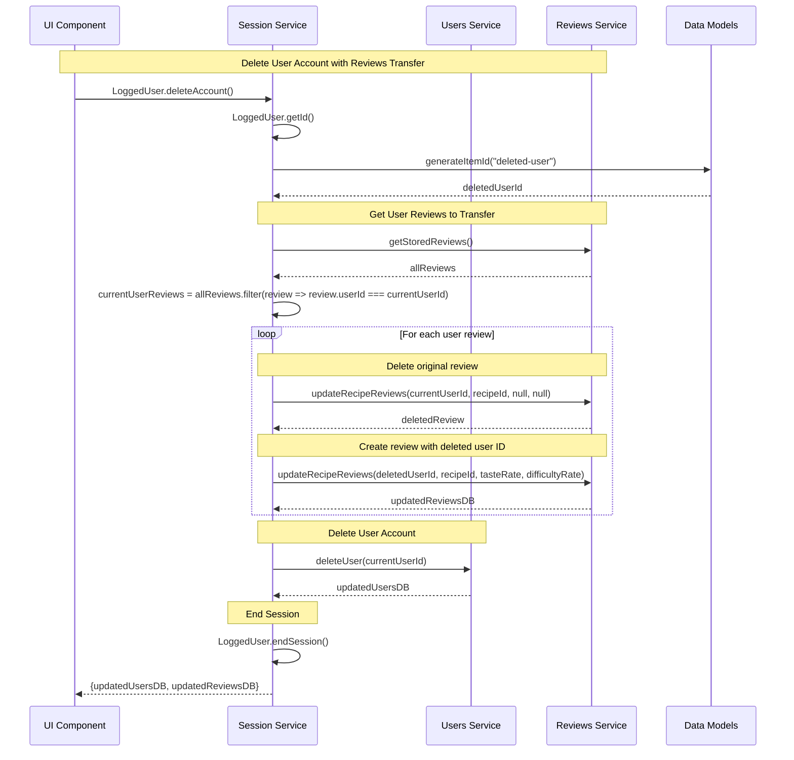
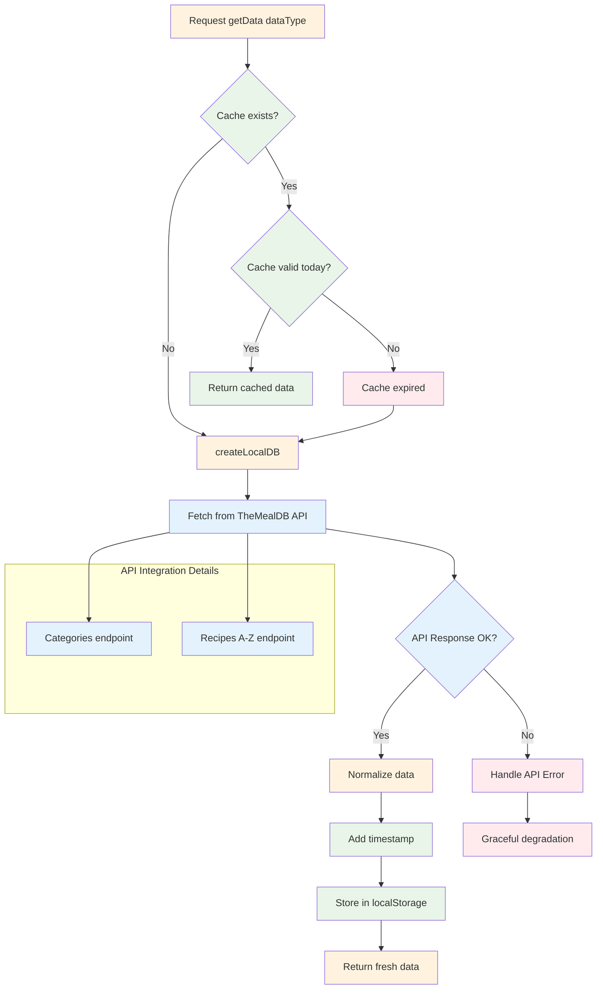
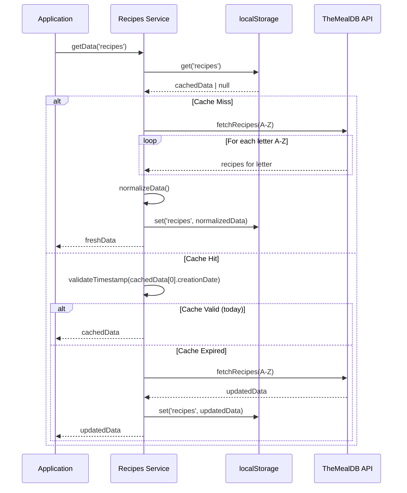

### RELAZIONE TECNICA - PROGETTO PGRC
**Piattaforma per la Gestione di Ricette di Cucina**

---
**Corso:** Programmazione Web e Mobile  
**Anno Accademico:** 2024/2025  
**Candidato:** Damiano Ghibaudo  
**Data:** Ottobre 2025

---
### INDICE

1. [Introduzione e Obiettivi](#1-introduzione-e-obiettivi)
2. [Architettura e Design](#2-architettura-e-design)
3. [Implementazione Core](#3-implementazione-core)
4. [Gestione Dati e API](#4-gestione-dati-e-api)
5. [Interfaccia Utente e UX](#5-interfaccia-utente-e-ux)
6. [Testing e Validazione](#6-testing-e-validazione)
7. [Conclusioni](#7-conclusioni)

---
<div style="page-break-before: always;"></div>

## 1. INTRODUZIONE E OBIETTIVI

<!-- <style>
/* stile per blocco file-tree: monospace, dimensione ridotta e tentativo di evitare page-break */
pre.file-tree {
    font-family: "Courier New", Courier, monospace;
    font-size: 0.75em;   
    line-height: 1.5;
    margin: 0 0 1rem 0;
    page-break-inside: avoid;
}
/* Evita che titoli h4 siano separati dal contenuto */
h4 {
    page-break-after: avoid;
}
</style> -->

### 1.1 Panoramica del Progetto

PGRC (Piattaforma per la Gestione di Ricette di Cucina) è un'applicazione web frontend-only sviluppata per soddisfare quattro macro-scenari funzionali:

1. **Gestione Profilo Utente:** Registrazione, autenticazione, modifica dati e cancellazione account
2. **Ricerca Ricette:** Integrazione con API TheMealDB per ricerca testuale e per categoria
3. **Ricettario Personale:** Sistema preferiti con note private personalizzabili
4. **Sistema Recensioni:** Rating duale (gusto/difficoltà) con aggregazione community

### 1.2 Vincoli Tecnici e Soluzioni Adottate

Il progetto rispetta rigorosamente i vincoli di consegna implementando le seguenti soluzioni e tecnologie:

- **Frontend Only:** HTML5, CSS3, JavaScript ES6+ senza dipendenze backend
- **Persistenza Locale:** Web Storage API (localStorage/sessionStorage) con architettura cache-first
- **Separazione Concerns:** Architettura modulare a tre layer (Presentation, Service, Data)
- **Responsive Design:** Mobile-first approach con CSS Grid e Flexbox

### 1.3 Valore Aggiunto Implementato

Oltre ai requisiti base, l'applicazione introduce:
- Session Service come orchestratore centrale con facade pattern
- Sistema di validazione dual-layer (UX + business logic) per dati utente
- Error handling tipizzato con classi custom
- Cache intelligente con refresh automatico per contenuti forniti da The Meal DB
- UI dinamica con event delegation pattern

---
<div style="page-break-before: always;"></div>

## 2. ARCHITETTURA E DESIGN

### 2.1 Struttura Modulare a Tre Layer

```
┌─────────────────────────────────────┐
│        PRESENTATION LAYER           │
│   (Pages + UI Components + CSS)     │
├─────────────────────────────────────┤
│         SERVICE LAYER               │
│     (Session Orchestration)         │
├─────────────────────────────────────┤
│           DATA LAYER                │
│  (Storage + API + Data Models)      │
└─────────────────────────────────────┘
```

## Presentation Layer
Le pagine HTML implementano struttura con separazione netta tra contenuto e presentazione. I componenti UI in `js/components/ui.js` gestiscono rendering dinamico e interazioni, mentre i page scripts in `js/pages/` orchestrano la logica specifica di ogni pagina.

## Service Layer 
Il `session-service.js` agisce come facade pattern esponendo namespace dedicati:
- `NewUser`: Operazioni utenti non autenticati (login, registrazione)
- `LoggedUser`: Gestione profilo e operazioni autenticate
- `Recipe`: Stato e operazioni su ricette
- `PreviewArray`: Generazione oggetti per popolamento UI

## Data Layer
Gestisce persistenza tramite `storage.js` (astrazione localStorage/sessionStorage), integrazione API con `recipes-service.js`, e modelli dati con `data-models.js` per entità business.

### 2.2 Design Pattern Strategici

## Factory Pattern per Data Models
Il sistema utilizza factory pattern per la creazione consistente di entità business:
- **User Factory:** Genera istanze utente con ID univoci, dati personali e array inizializzati per preferiti/note
- **Recipe Factory:** Normalizza dati API TheMealDB in formato interno consistente
- **Review Factory:** Crea recensioni con validazione parametri e timestamp automatici
- **ID Generation:** Sistema centralizzato per generazione identificatori univoci basati su timestamp e randomizzazione
<!-- page-break removed -->

## Strategy Pattern per Error Handling
Sistema di gestione errori tipizzato con classi custom per scenari specifici:
- **NotFound (404):** Entità non trovate con dettagli campo/valore per debugging
- **Duplicated (409):** Violazioni unicità con identificazione campo duplicato
- **InvalidFormat (422):** Errori validazione formato con messaggio specifico

Ogni classe mantiene codice HTTP, tipo entità e metadati per logging centralizzato.

## Event Delegation Pattern
Il sistema implementa event delegation per gestire interazioni su contenuto generato dinamicamente:

**Strategia Implementata:**
- **Single Event Listener:** Un listener sul container padre gestisce eventi di tutti gli elementi figli
- **Target Detection:** Utilizzo di `closest()` e `matches()` per identificare l'elemento specifico cliccato
- **Action Routing:** Logic condizionale per instradare azioni diverse (navigazione vs. toggle preferiti)
- **Authentication Guard:** Controllo stato utente per proteggere operazioni autenticate

**Vantaggi Tecnici:**
- **Performance:** Riduzione memoria con un solo listener invece di N listener per N elementi
- **Dinamicità:** Gestione automatica di elementi aggiunti/rimossi dinamicamente
- **Manutenibilità:** Centralizzazione logica eventi in un singolo punto

## Event Flow Sequence


<div style="page-break-before: always;"></div>

### 2.3 Organizzazione File System
<pre class="file-tree">
PGRC-project/
├── index.html                 # Homepage con carousel ricette popolari
├── style.css                  # Stili CSS principali responsive
├── favicon.ico                # Icona applicazione
├── specifiche-progetto.md     # Documentazione requisiti originali
│
├── pages/                     # Pagine HTML dell'applicazione
│   ├── favourites.html        # Ricettario personale con tab
│   ├── login.html             # Autenticazione utente
│   ├── recipe-details.html    # Dettaglio ricetta completo
│   ├── search.html            # Ricerca e risultati
│   ├── settings.html          # Gestione profilo utente
│   └── signin.html            # Registrazione nuovo utente
│
├── js/                        # Moduli JavaScript
│   ├── core/                  # Moduli fondamentali
│   │   ├── data-models.js     # Factory per entità business (User, Recipe, Review, Note)
│   │   ├── errors.js          # Error classes tipizzate (NotFound, Duplicated, InvalidFormat)
│   │   └── storage.js         # Astrazione Web Storage unificata
│   │
│   ├── services/              # Business logic layer
│   │   ├── session-service.js # Orchestratore centrale con namespace (NewUser, LoggedUser, Recipe)
│   │   ├── users-service.js   # CRUD utenti + sicurezza + validazione
│   │   ├── recipes-service.js # API integration + cache TheMealDB
│   │   └── reviews-service.js # Sistema recensioni con aggregazione
│   │
│   ├── components/            # Componenti UI riutilizzabili
│   │   └── ui.js              # Factory card, rating display, popolamento container
│   │
│   └── pages/                 # Script specifici per pagina
│       ├── index.js           # Homepage con carousel e categorie
│       ├── login.js           # Autenticazione e gestione sessione
│       ├── signin.js          # Registrazione con validazione real-time
│       ├── search.js          # Ricerca ricette e gestione risultati
│       ├── recipe-details.js  # Dettaglio ricetta con recensioni e note
│       ├── favourites.js      # Ricettario personale con tab (preferiti/note)
│       └── settings.js        # Modifica profilo e cancellazione account
│
├── assets/                    # Risorse statiche
│   └── images/
│       ├── no_image.jpg       # Immagine fallback per ricette senza foto
│       └── Pot_logo.png       # Logo applicazione
│
├── bootstrap/                 # Framework CSS/JS
│   ├── css/                   # Stili Bootstrap 5
│   ├── js/                    # JavaScript Bootstrap 5
│   └── icons/                 # Bootstrap Icons
│
└── utils/                     # Utilità sviluppo
    └── create-user-db.js      # Script creazione database utenti test
</pre>

---

<div style="page-break-after: always;"></div>

## 3. IMPLEMENTAZIONE CORE

### 3.1 Session Service: Orchestrazione Centralizzata

Il Session Service (`js/services/session-service.js`) rappresenta il cuore architetturale dell'applicazione, implementando il pattern **Facade** per fornire una API unificata che astrae la complessità della gestione stati utente, operazioni business e interazioni con storage.

## Architettura e Scopo

Il modulo organizza tutte le operazioni in namespace logici che corrispondono ai diversi contesti d'uso dell'applicazione:

- **Separazione concerns:** Ogni namespace gestisce un dominio specifico (utenti non autenticati, utenti loggati, operazioni ricette)
- **Single source of truth:** Centralizza lo stato dell'applicazione evitando inconsistenze
- **Astrazione complessità:** Nasconde ai componenti UI la logica di business e storage

### _ Namespace NewUser: Gestione Utenti Non Autenticati

Il namespace gestisce operazioni per utenti non autenticati tramite funzioni `startSession()` per login e `addToDB()` per registrazione. La **logica del login** integra tre passaggi atomici: autenticazione credenziali, recupero ID utente, e aggiornamento stato sessione in sessionStorage. Questo pattern garantisce che un fallimento in qualsiasi fase non lasci l'applicazione in stato inconsistente.

#### Login Flow Sequence



## Namespace LoggedUser: Operazioni Utente Autenticato

Il namespace espone operazioni che richiedono autenticazione, utilizzando sempre `LoggedUser.getId()` per recuperare l'ID dell'utente corrente dal sessionStorage. Include gestione preferiti con toggle automatico e funzionalità profilo.

La **funzione di eliminazione account** implementa una logica particolare per preservare l'integrità del sistema recensioni, trasferendo tutte le recensioni dell'utente a un "utente eliminato" prima di rimuovere l'account, garantendo che le statistiche rimangano integre.



## Namespace PreviewArray: Generazione Dati per UI

Questo namespace risolve il problema della **preparazione dati per il rendering UI**, fornendo oggetti strutturati che contengono sia il tipo di contenuto che i dati formattati. Le principali strategie implementate includono:

- **`mostPopular()`:** Algoritmo che calcola ricette più popolari basandosi sul numero di recensioni
- **`favourites()`:** Estrazione ricette preferite dell'utente con metadati aggiuntivi
- **`categories()`:** Formattazione categorie TheMealDB per navigazione
- **`searchResults()`:** Preparazione risultati ricerca con scoring di rilevanza

La funzione `mostPopular()` implementa una **strategia del fallback** che garantisce contenuti sempre disponibili anche quando il database recensioni è insufficiente, riempiendo con ricette casuali.

### 3.2 Cache-First Strategy per Performance

Il sistema adotta una **strategia cache-first** per ottimizzare le performance e ridurre le chiamate API. La politica implementata prevede:

**Controllo Temporale**: Validazione quotidiana della cache confrontando timestamp di creazione con data corrente. I dati vengono considerati validi se creati in giornata, altrimenti viene forzato un refresh automatico.

**Gestione Invalidazione**: La cache diventa obsoleta giornalmente per garantire freschezza dei contenuti API. Questa scelta bilancia performance locale con aggiornamenti regolari dei dati esterni.

**Fallback Strategy**: In caso di errori di connessione o problemi API, il sistema mantiene e utilizza i dati cache precedenti quando disponibili, garantendo continuità di servizio anche in condizioni di rete instabile.





### 3.3 Validazione Dual-Layer

Il sistema di validazione implementa un **approccio dual-layer** che separa la **responsabilità UX** (feedback immediato) dalla **logica business** (sicurezza e integrità dati), garantendo sia usabilità che robustezza.

## Layer Presentation: Validazione UX Real-time

Il layer di presentazione gestisce l'**esperienza utente** con validazione immediata e feedback visivo tramite la funzione `formatInputField()` che applica classi Bootstrap (`is-valid`/`is-invalid`) e mostra messaggi specifici basati sul tipo di errore ricevuto dal layer business.

## Layer Business: Sicurezza e Integrità

Il layer business implementa **validazioni rigorose** con controlli di formato tramite regex, unicità nel database utenti, e requisiti di sicurezza. Include validazione email pattern, password con requisiti complessi (maiuscola, minuscola, numero, lunghezza minima) e hashing sicuro SHA-256 tramite Web Crypto API.

## Orchestrazione Validazione

Il Session Service orchestra la validazione attraverso `inputValidation()` che determina il tipo di controllo da eseguire e propaga gli errori tipizzati per il rendering UI. Questa architettura garantisce **separazione**, **riusabilità** e **sicurezza multi-layer**.

### 3.4 Sistema Recensioni con Rating Duale

Il sistema recensioni (`js/services/reviews-service.js`) implementa un **rating duale gusto/difficoltà** con un'architettura CRUD semplificata che utilizza un **pattern toggle intelligente** per gestire aggiunta e rimozione recensioni attraverso un'unica funzione.

## Logica Toggle e Business Rules

Il cuore del sistema è la funzione `updateRecipeReviews()` che implementa il **pattern toggle intelligente**: se invocata con tutti i parametri (userId, recipeId, tasteRate, difficultyRate) crea una nuova recensione, se invocata solo con userId e recipeId rimuove la recensione esistente. Questa logica unificata semplifica l'interfaccia e garantisce operazioni atomiche.

## Implementazione Business Rules

1. **Unicità utente-ricetta:** Un utente può recensire una ricetta solo una volta
2. **Validazione parametri:** ADD richiede tutti i parametri, DELETE solo userId e recipeId
3. **Gestione errori tipizzati:** `Duplicated` per violazioni unicità, `NotFound` per recensioni inesistenti

## Aggregazione Real-time

Il sistema calcola statistiche on-demand tramite `recipeAvgRate()` senza caching per garantire sempre dati aggiornati. La **strategia real-time**  richiede calcoli ripetuti, ma evita sovraccarico durante il caricamento iniziale di ricette e pagine, spostando il costo computazionale al momento della visualizzazione ed evita problemi di sincronizzazione cache. Per l'ambito del presente progetto, la performance è accettabile dato il dataset limitato.

**Ottimizzazioni Performance:** Il calcolo real-time evita sovraccarico durante il caricamento iniziale di ricette e pagine, spostando il costo computazionale al momento della visualizzazione when needed. Per l'ambito del presente progetto, la performance è accettabile dato il dataset limitato.

## Integrazione con UI

Il sistema espone funzioni specifiche per le esigenze dell'interfaccia:

- **Rating personali:** `recipeUserRate()` per mostrare le valutazioni dell'utente loggato  
- **Rating aggregati:** `recipeAvgRate()` per le statistiche community
- **Deep copy:** `getStoredReviews()` restituisce sempre copie profonde per evitare mutazioni accidentali

### 3.5 Implementazione Tecnica API Integration

Il modulo `js/services/recipes-service.js` implementa la strategia cache-first descritta nella sezione 3.2 attraverso:

## Architettura Cache-First

La funzione orchestratrice `getData(dataType)` implementa la logica cache intelligente attraverso:

- **Controllo Validità**: Confronta il timestamp di creazione del primo elemento cache con la data corrente
- **Caricamento Completo**: Le funzioni `createLocalRecipesDB()` e `createLocalCategoriesDB()` scaricano l'intero database API tramite iterazione A-Z per superare l'assenza di un endpoint "get all recipes"
- **Gestione HTTP**: `fetchRecipes()` agisce come wrapper unificato per tutte le chiamate HTTP con error handling integrato
- **Normalizzazione**: I dati vengono convertiti in formato interno ottimizzato e salvati in localStorage con timestamp
- **Graceful Degradation**: In caso di errori API, il sistema mantiene i dati cache precedenti garantendo continuità di servizio

## Algoritmo di Ricerca Multi-termine

La ricerca per nome implementa un **algoritmo di scoring** che normalizza query e nomi ricette, assegna punteggi basati su match esatti (20 punti) e parziali (10 punti), con penalizzazione posizionale e bonus per match completi. La **logica di scoring** privilegia ricette con nomi che matchano completamente la query, penalizzando match parziali su termini secondari.

---

## 4. GESTIONE DATI E API

### 4.1 Integrazione TheMealDB API

L'applicazione utilizza due endpoint strategici di TheMealDB:
- **Categorie:** `https://www.themealdb.com/api/json/v1/1/categories.php`
- **Ricette per lettera:** `https://www.themealdb.com/api/json/v1/1/search.php?f={letter}`

La scelta del secondo endpoint consente caricamento completo del database (A-Z) implementando ricerca lato client con algoritmo di scoring per rilevanza.

### 4.2 Modelli Dati Normalizzati
La classe `FullRecipe` in `js/core/data-models.js` normalizza i dati API TheMealDB:
- **Mapping Campi:** Conversione automatica da formato API a struttura interna consistente
- **Ingredients Parsing:** Metodo `getIngredients(rawRecipeObj)` per estrazione ingredienti con misure da campi numerati (1-20)
- **Fallback Values:** Gestione campi mancanti con valori di default e immagine placeholder
- **Timestamp Creation:** Aggiunta automatica `creationDate` per cache management

### 4.3 Storage Strategy Unificata

Il sistema di storage unificato (`js/core/storage.js`) astrae localStorage/sessionStorage attraverso il namespace `StorageOperations`:

**Operazioni Core:**
- `get(storageKey, options)`: Recupero dati con deserializzazione automatica per tipo (array/string)
- `set(storageKey, data, options)`: Salvataggio con serializzazione automatica JSON

**Gestione Tipi e Opzioni:**
- Parsing automatico JSON per array con fallback array vuoto
- Gestione string con fallback stringa vuota  
- Selezione storage engine: `{storageLocation: "local"|"session", dataType: "array"|"string"}`
- Error handling con logging per debugging e re-throw per propagazione

---

<!-- <div style="page-break-before: always;"></div> -->

## 5. INTERFACCIA UTENTE E UX

### 5.1 Responsive Design Mobile-First

L'approccio mobile-first è implementato tramite CSS Grid e media queries. Il file `style.css` definisce breakpoint ottimizzati per tutti i dispositivi:

- **Mobile (320px+):** Layout single-column con card verticali
- **Tablet (560px+):** Grid a 2 colonne con card orizzontali  
- **Desktop (720px+):** Grid ottimizzata con hover effects

La navbar utilizza Bootstrap 5 con design fixed-top e dropdown menu per la navigazione, mentre i container di ricette implementano CSS Grid responsive con `auto-fill` e `minmax()` per adattamento automatico.

### 5.2 Architettura Componenti UI

Il sistema di rendering (`js/components/ui.js`) implementa un'**architettura component-based** con pattern Factory per la generazione dinamica di elementi DOM, risolvendo il problema della **creazione consistente di UI elements** senza framework esterni.

## Pattern Factory per Elementi DOM

Il cuore del sistema è il **factory pattern** implementato nelle funzioni private che generano elementi DOM standardizzati come `createPreviewCard()`. Ogni elemento include data attributes per event delegation e supporta inserimento condizionale di contenuto body specifico (rating, note, etc.).

## Strategy Pattern per Contenuti Dinamici

Il sistema utilizza uno **strategy Pattern** attraverso il namespace `CardDisplayStrategy` per gestire diversi tipi di contenuto nelle card: `withGlobalRating`, `withUserRating`, `withNotes`. Ogni strategia formatta i dati specifici e gestisce graceful degradation in caso di errori.

## Gestione Stati UI Centralizzata

Il modulo centralizza la gestione degli **stati UI dinamici** attraverso funzioni dedicate come `favBtnDisplay()` che sincronizza l'interfaccia con lo stato applicativo, gestendo automaticamente il toggle delle icone preferiti basandosi sullo stato utente e ricetta.

## Popolazione Container con Type-Based Rendering

Il sistema di popolazione implementa **type-based rendering** tramite `populatePreviewContainer()` che adatta automaticamente il contenuto in base al tipo di dati ricevuti (meals, reviews, notes, categories), selezionando la strategia di rendering appropriata dal namespace `CardDisplayStrategy`. 

**Integrazione con PreviewArray:** Il sistema si basa sui dati strutturati forniti dal namespace `PreviewArray` del Session Service, che pre-formatta i contenuti con metadati tipo e array elementi pronti per il rendering. Questa separazione garantisce che la logica business (PreviewArray) rimanga distinta dalla presentazione (UI components).

Questa architettura garantisce **consistenza visiva**, **riusabilità dei componenti** e **facilità di manutenzione** senza la complessità di framework esterni.

### 5.3 Gestione Stati UI e Navbar Dinamica

Il progetto implementa gestione stati tramite classi Bootstrap e funzioni dedicate. Gli stati di loading vengono gestiti con overlay CSS, mentre la validazione form utilizza le classi `is-valid`/`is-invalid` di Bootstrap per feedback real-time.

La navbar dinamica si aggiorna automaticamente basandosi sullo stato di autenticazione, mostrando menu contestuali per utenti loggati (dropdown con username, settings, logout) o guest (solo search e login) tramite il dropdown menu del logo.

---

<!-- <div style="page-break-before: always;"></div> -->

## 6. TESTING E VALIDAZIONE

### 6.1 Test Scenari Critici

## Scenario 1: Workflow Completo Utente
```
Registrazione → Login → Ricerca → Dettaglio → Preferiti → Recensione → Note
```

**Risultati verificati:**
-  Validazione form real-time con feedback Bootstrap
-  Persistenza dati localStorage attraverso refresh pagina
-  Sincronizzazione stato UI con storage (preferiti, recensioni)
-  Cache-first strategy riduce chiamate API duplicate

## Scenario 2: Gestione Errori e Edge Cases
```
Dati incompleti API → Valori null/undefined → Connessione lenta → Form validation
```

**Risultati:**
-  Fallback chain per dati API incompleti (campi vuoti invece di errori)
-  Graceful degradation con console.error per debugging
-  Validazione robusta input utente con feedback specifico
-  Loading states per operazioni asincrone lunghe

### 6.2 Test Performance e Compatibilità

## Metriche Performance
- **Page Load:** Rapido con cache (localStorage/sessionStorage)
- **API Response:** Dipendente da TheMealDB (variabile 200ms-2s)
- **Storage Access:** Sincrono e immediato (localStorage)
- **UI Interactions:** Responsivo con event delegation pattern

## Browser Compatibility

**Requisiti per Piena Compatibilità:**
- **ES6+ Support:** Moduli JavaScript, async/await, destructuring, structuredClone
- **Web Storage API:** localStorage e sessionStorage per persistenza dati
- **Fetch API:** Per integrazione TheMealDB (con polyfill per browser legacy)
- **CSS Grid/Flexbox:** Layout responsive e componenti Bootstrap 5

**Browser Moderni Supportati:**
- Chrome, Firefox, Safari, Edge (versioni recenti con supporto ES6+ completo)
- Mobile browsers moderni con Web APIs standard

### 6.3 Test Responsive Design

## Breakpoint Testing
- **Mobile (320-559px):** Layout single-column, card verticali con dimensione del body adattiva
- **Tablet (560-719px):** Grid 2-colonne, card orizzontali  
- **Desktop (720px+):** Grid ottimizzata, card orizzontali
---

## 7. CONCLUSIONI

### 7.1 Analisi Decisioni Architetturali

**Three-Layer Architecture:**
- *Vantaggi:* Separazione concerns, modularità, manutenibilità del codice
- *Svantaggi:* Overhead per progetti semplici, complessità iniziale setup
- *Trade-off:* Scalabilità futura vs. semplicità immediata

**Session Service Pattern:**
- *Vantaggi:* API unificata, single source of truth, consistenza, debugging semplificato
- *Svantaggi:* Single point of failure, accentramento responsabilità 
- *Trade-off:* Controllo centralizzato e modularità vs. distribuzione responsabilità

**Event Delegation Pattern:**
- *Vantaggi:* Performance con contenuto dinamico, memoria ottimizzata, gestione centralizzata
- *Svantaggi:* Debugging più complesso, controllo granulare limitato
- *Trade-off:* Efficienza vs. granularità controllo eventi

### 7.2 Conformità Requisiti Vincolanti

**Vincoli Frontend-Only:**
- *Implementazione:* HTML5/CSS3/JavaScript ES6+ puro senza backend
- *Implicazioni:* Validazione solo client-side, sicurezza limitata, nessuna elaborazione server

**Cache-First Strategy (Requisito):**
- *Implementazione:* localStorage per ricette, refresh giornaliero automatico
- *Implicazioni:* Riduzione chiamate API ma gestione manuale cache

**Web Storage API (Requisito):**
- *Implementazione:* localStorage/sessionStorage per persistenza completa
- *Implicazioni:* Storage limitato (~5MB), volatilità dati, nessuna concorrenza

### 7.3 Valutazione Scelte Tecnologiche

**JavaScript ES6+ Modules:**
- *Vantaggi:* Import/export nativi, tree-shaking, sviluppo modulare
- *Svantaggi:* Compatibilità browser limitata, nessun bundling/minification
- *Impatto:* Codice più pulito ma deployment meno ottimizzato

**Bootstrap 5:**
- *Vantaggi:* UI consistency, componenti ready-to-use, responsive integrato
- *Svantaggi:* Bundle size, personalizzazione limitata, dipendenza esterna
- *Impatto:* Velocità sviluppo vs. controllo granulare styling

### 7.4 Strategia Performance vs. Semplicità di Sviluppo

**Scelta Progettuale: Semplicità Prima di Performance**

Data la natura accademica del progetto e la **mole di dati limitata** (dataset utenti locale, ricette API esterna con cache), si è deliberatamente privilegiata la **semplicità di sviluppo** rispetto alle ottimizzazioni di performance avanzate.

**Esempi di Scelte Semplificate:**
- **Funzioni di interrogazione iterative:** funzioni di interrogazione come `Recipe.isFavourite()` eseguono ricerche lineari senza caching interno
- **Calcoli aggregati real-time:** Statistiche recensioni calcolate on-demand senza pre-computazione
- **Validazioni ridondanti:** Controlli duplicati tra layer per robustezza invece di ottimizzazione
- **Operazioni atomiche ripetute:** Privilegio per atomicità garantita con ripetizione operazioni invece di ottimizzazioni batch

**Razionale della Decisione:**
- *Dataset piccolo:* Utenti limitati, ricette disponibili localmente, operazioni O(n) accettabili
- *Manutenibilità:* Codice lineare e leggibile, debugging semplificato
- *Coerenza garantita:* Operazioni atomiche prevengono stati inconsistenti
- *Time-to-market:* Focus su completezza funzionale rispetto a micro-ottimizzazioni

**Implicazioni per Ambiente di Produzione:**
Per un utilizzo in produzione con mole di dati significativa (migliaia di utenti, database estesi), sarebbero necessarie ottimizzazioni quali:
- **Sistema di caching:** Per ridurre calcoli ripetitivi
- **Database dedicato:** Per gestire volumi maggiori e concorrenza
- **Ottimizzazioni algoritmi:** Per migliorare performance con dataset grandi

**Trade-off Accettato:**
Considerati il contesto e la scala del progetto, si è scelto di accettare latenza aggiuntiva marginale per privilegiare **architettura chiara**, **codice facilmente manutenibile** e **tempi di sviluppo ottimizzati**.  

### 7.5 Conformità Requisiti vs. Limitazioni

**Vincoli Rispettati:**
- Frontend-only: Nessuna dipendenza backend
- Web Storage: localStorage/sessionStorage per persistenza
- API Integration: TheMealDB con gestione asincrona
- Responsive: Mobile-first con breakpoint definiti

**Limitazioni Intrinseche:**
- Sicurezza: Validazione solo client-side, dati esposti
- Scalabilità: Storage quota browser, nessuna gestione concorrenza
- Affidabilità: Dipendenza API esterna
- Performance: latenza API variabile

### 7.6 Impatto Decisioni sul Prodotto Finale

L'architettura implementata risulta **appropriata per il contesto accademico** con requisiti frontend-only, fornendo equilibrio tra complessità implementativa e funzionalità complete. Le scelte tecnologiche sono state orientate verso **conformità ai vincoli** e **tentativo di predisposizione per scalabilità futura**.

Il sistema, pur operando nei limiti dei vincoli frontend-only, rappresenta un **tentativo di architettura predisposta per integrazione backend** con **struttura estendibile** che potrebbe facilitare evoluzioni verso soluzioni production-ready.

---

**Fine Relazione Tecnica**

*Documento rappresentativo del progetto PGRC - Programmazione Web e Mobile A.A. 2025/2026*