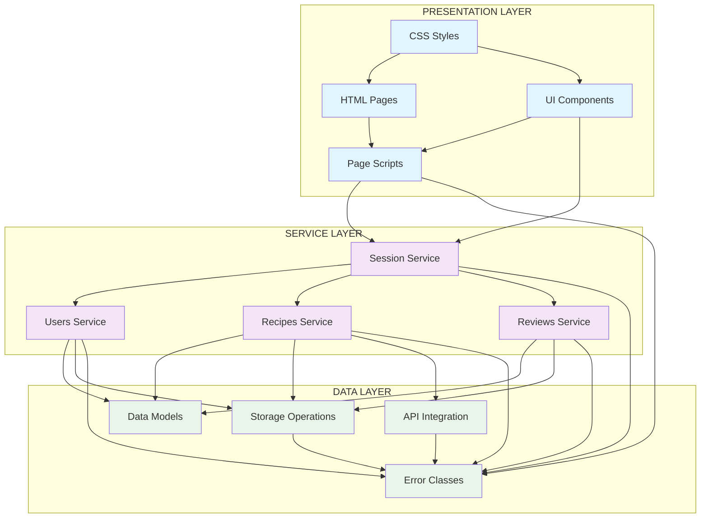

# Diagramma Architettura Three-Layer - PGRC

## Architettura Modulare a Tre Layer

## Dettaglio Responsabilità

### Presentation Layer
- **HTML Pages**: Struttura semantica delle pagine
- **CSS Styles**: Presentazione e responsive design
- **UI Components**: Factory per elementi DOM dinamici
- **Page Scripts**: Logica specifica per ogni pagina

### Service Layer
- **Session Service**: Orchestratore centrale con pattern Facade
- **Users Service**: CRUD utenti + autenticazione
- **Recipes Service**: Integrazione API + cache management
- **Reviews Service**: Sistema rating duale con aggregazione

### Data Layer
- **Data Models**: Factory per entità business
- **Storage Operations**: Astrazione localStorage/sessionStorage
- **API Integration**: Wrapper chiamate HTTP
- **Error Classes**: Gestione errori tipizzati