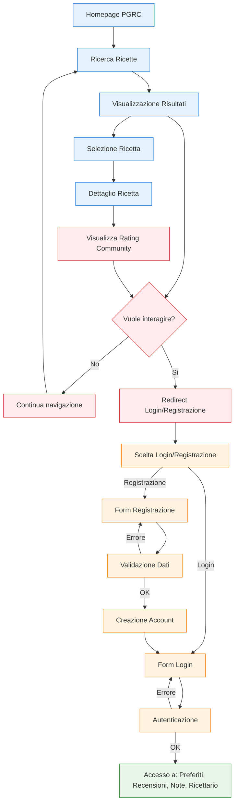

# User Journey - PGRC

## Flusso Utente Non Autenticato (Guest)

```mermaid
flowchart TD
    A[Homepage PGRC] --> B[Ricerca Ricette]
    B --> C[Visualizzazione Risultati]
    C --> D[Selezione Ricetta]
    C --> G{Vuole interagire?}
    D --> E[Dettaglio Ricetta]
    E --> F[Visualizza Rating Community]
    F --> G
    G -->|No| H[Continua navigazione]
    G -->|Sì| I[Redirect Login/Registrazione]
    H --> B
    
    %% Processo Autenticazione
    I --> J[Scelta Login/Registrazione]
    J -->|Registrazione| K[Form Registrazione]
    J -->|Login| L[Form Login]
    K --> M[Validazione Dati]
    M -->|Errore| K
    M -->|OK| N[Creazione Account]
    N --> L
    L --> O[Autenticazione]
    O -->|Errore| L
    O -->|OK| P[Accesso a: Preferiti, Recensioni, Note, Ricettario]
    
    classDef navigation fill:#e3f2fd,stroke:#1976d2
    classDef viewing fill:#ffebee,stroke:#d32f2f
    classDef authentication fill:#fff3e0,stroke:#f57c00
    classDef complete fill:#e8f5e8,stroke:#388e3c
    
    class A,B,C,D,E navigation
    class F,G,H,I viewing
    class J,K,L,M,N,O authentication
    class P complete
```