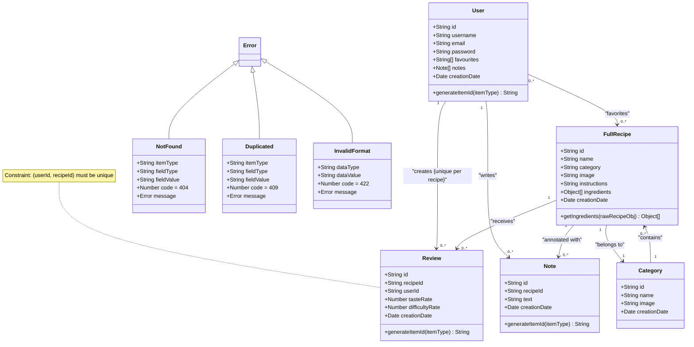
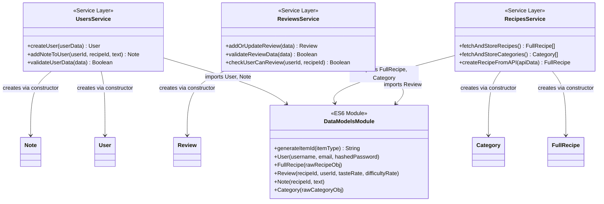

# Diagramma Classi Data Models - PGRC

## UML Class Diagram per Data Models

```mermaid
classDiagram
    class User {
        +String id
        +String username
        +String email
        +String password
        +String[] favourites
        +Note[] notes
        +Date creationDate
        +generateItemId(itemType) String
    }
    
    class FullRecipe {
        +String id
        +String name
        +String category
        +String image
        +String instructions
        +Object[] ingredients
        +Date creationDate
        +getIngredients(rawRecipeObj) Object[]
    }
    
    class Review {
        +String id
        +String recipeId
        +String userId
        +Number tasteRate
        +Number difficultyRate
        +Date creationDate
        +generateItemId(itemType) String
    }
    
    class Note {
        +String id
        +String recipeId
        +String text
        +Date creationDate
        +generateItemId(itemType) String
    }
    
    class Category {
        +String id
        +String name
        +String image
        +Date creationDate
    }
    
    class NotFound {
        +String itemType
        +String fieldType
        +String fieldValue
        +Number code = 404
        +Error message
    }
    
    class Duplicated {
        +String itemType
        +String fieldType
        +String fieldValue
        +Number code = 409
        +Error message
    }
    
    class InvalidFormat {
        +String dataType
        +String dataValue
        +Number code = 422
        +Error message
    }
    
    %% Relationships
    User "1" --> "0..*" Review : "creates {unique per recipe}"
    User "1" --> "0..*" Note : "writes"
    FullRecipe "1" --> "0..*" Review : "receives"
    FullRecipe "1" --> "0..*" Note : "annotated with"
    User "0..*" --> "0..*" FullRecipe : "favorites"
    Category "1" --> "0..*" FullRecipe : "contains"
    FullRecipe "1" --> "1" Category : "belongs to"
    
    %% Business Rules
    note for Review "Constraint: (userId, recipeId) must be unique"
    
    Error <|-- NotFound
    Error <|-- Duplicated
    Error <|-- InvalidFormat
    
    classDef entity fill:#e3f2fd
    classDef error fill:#ffebee
```

## Data Models Module Pattern

```mermaid
classDiagram
    class DataModelsModule {
        <<ES6 Module>>
        +generateItemId(itemType) String
        +User(username, email, hashedPassword)
        +FullRecipe(rawRecipeObj)
        +Review(recipeId, userId, tasteRate, difficultyRate)
        +Note(recipeId, text)
        +Category(rawCategoryObj)
    }
    
    class UsersService {
        <<Service Layer>>
        +createUser(userData) User
        +addNoteToUser(userId, recipeId, text) Note
        +validateUserData(data) Boolean
    }
    
    class RecipesService {
        <<Service Layer>>
        +fetchAndStoreRecipes() FullRecipe[]
        +fetchAndStoreCategories() Category[]
        +createRecipeFromAPI(apiData) FullRecipe
    }
    
    class ReviewsService {
        <<Service Layer>>
        +addOrUpdateReview(data) Review
        +validateReviewData(data) Boolean
        +checkUserCanReview(userId, recipeId) Boolean
    }
    
    %% Dependencies
    UsersService --> DataModelsModule : imports User, Note
    RecipesService --> DataModelsModule : imports FullRecipe, Category
    ReviewsService --> DataModelsModule : imports Review
    
    %% Service to Model Creation
    UsersService --> User : creates via constructor
    UsersService --> Note : creates via constructor
    RecipesService --> FullRecipe : creates via constructor
    RecipesService --> Category : creates via constructor
    ReviewsService --> Review : creates via constructor
    
    classDef module fill:#e8f5e8
    classDef service fill:#fff3cd
    classDef entity fill:#e3f2fd
```