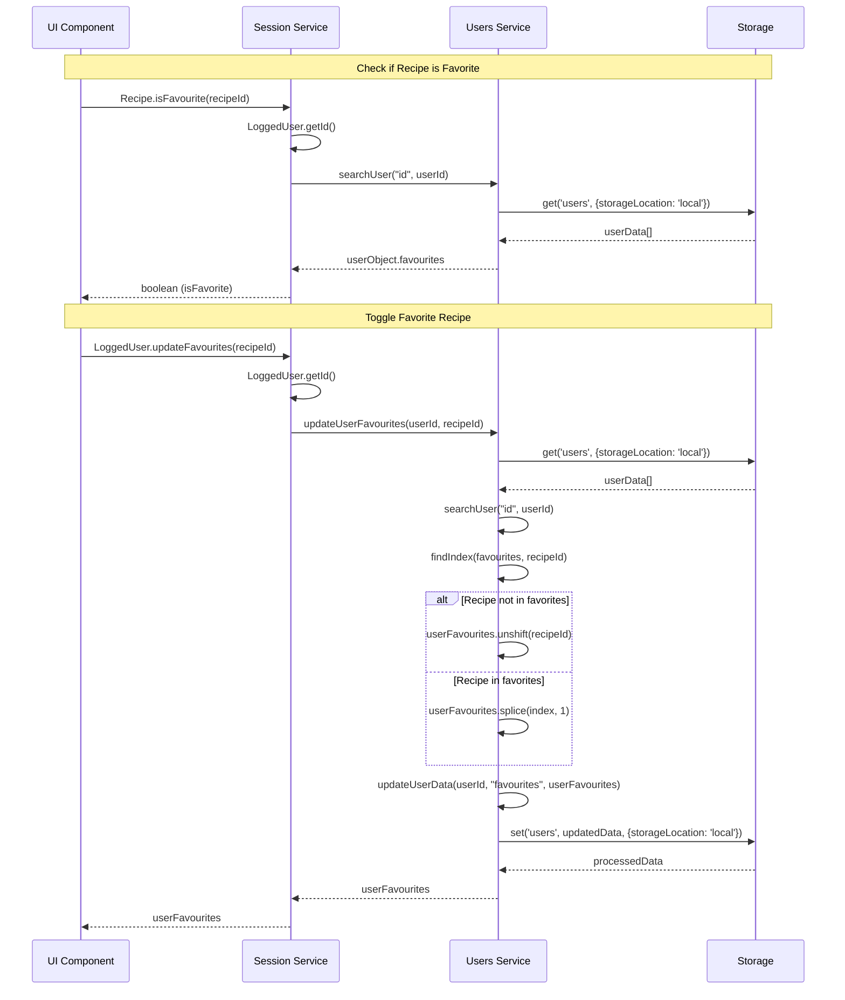
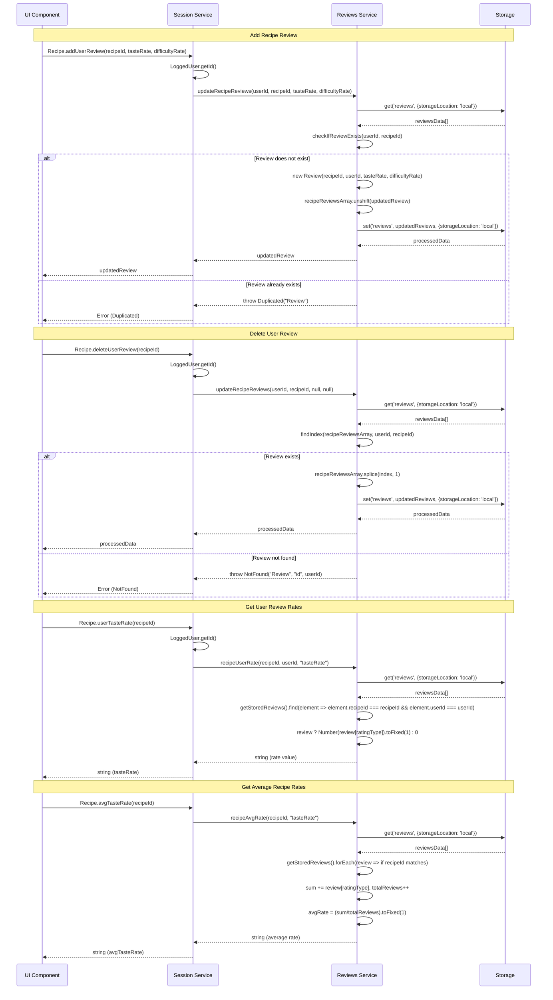
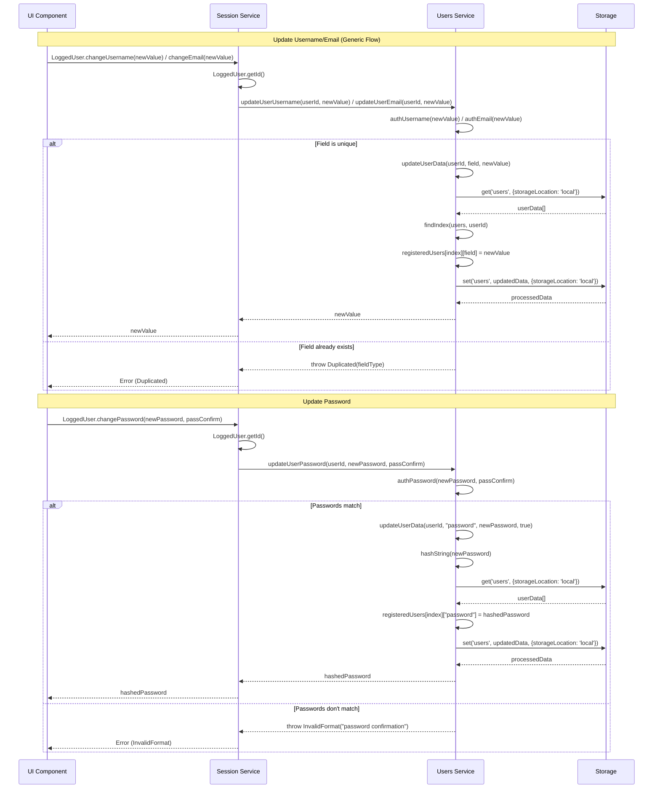
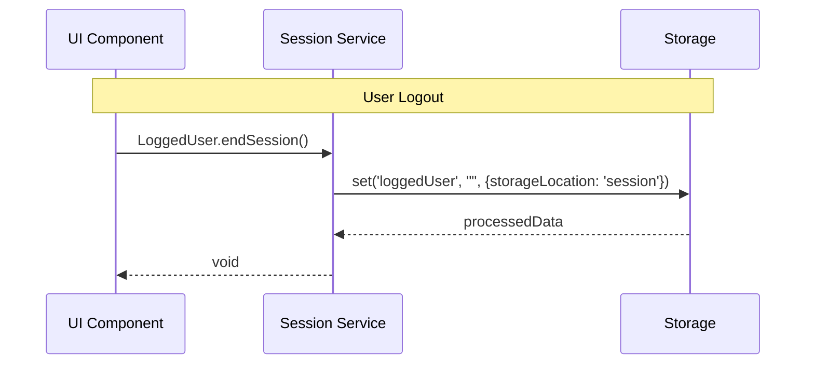
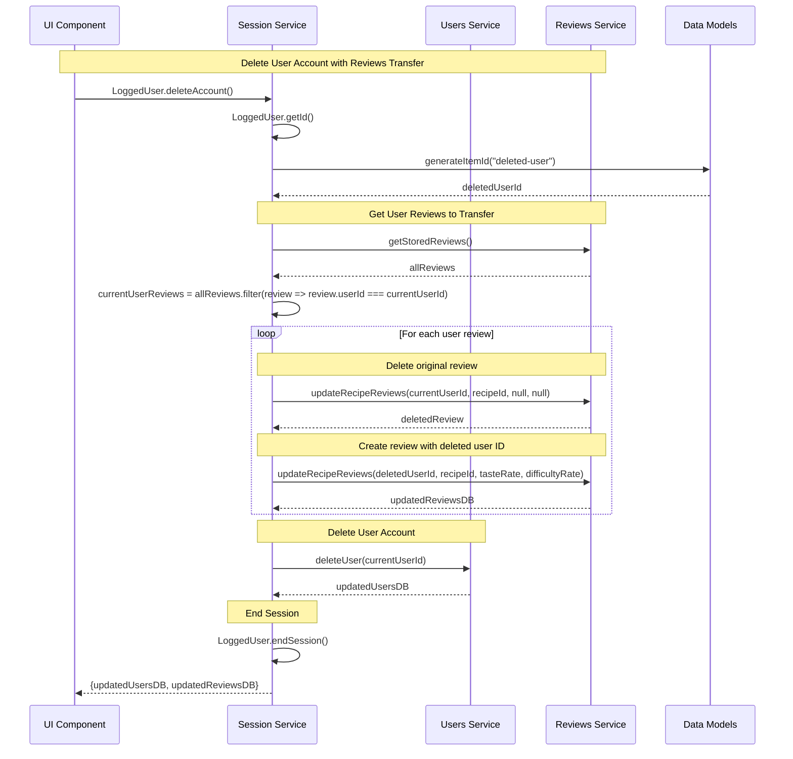
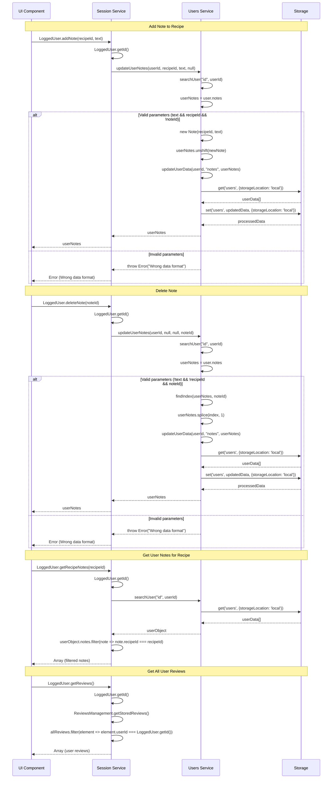
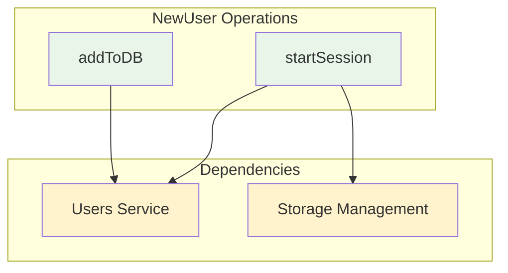
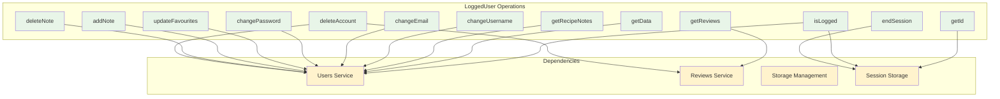
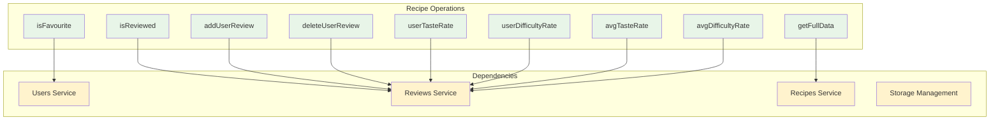
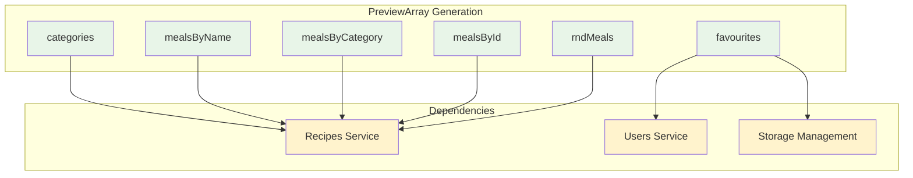

# Diagramma Session Service - PGRC

## 1. Login Flow Sequence

## 2. Recipe Operations Flow

## 3. Review System Flow

## 5. Profile Update Flow

## 6. Logout Flow

## 7. Delete Account Flow

## 4. Notes Management Flow

## Session Service Architecture

### NewUser Namespace Operations

### LoggedUser Namespace Operations

### Recipe Namespace Operations

### PreviewArray Namespace Operations

