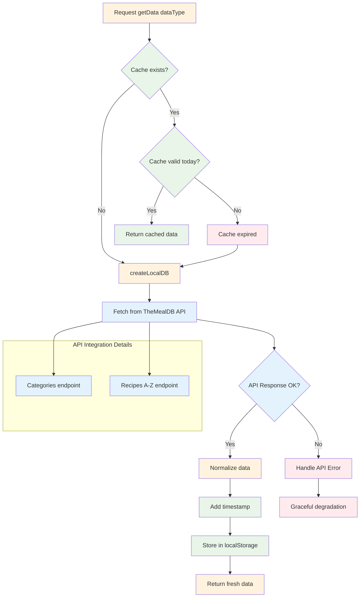
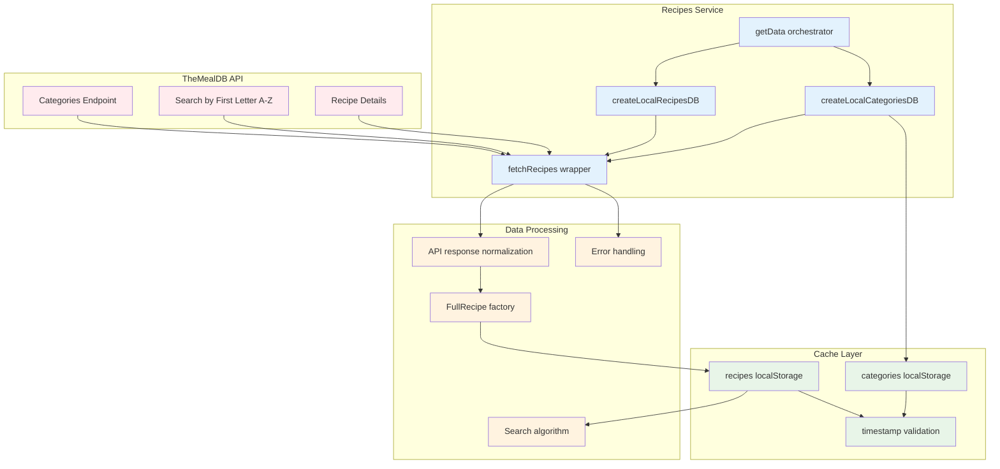
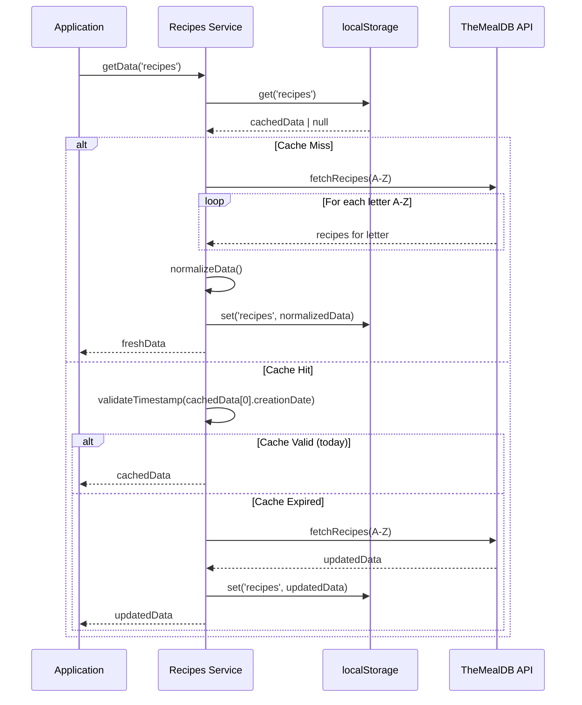

# Cache-First Strategy Flow - PGRC

## Cache-First Strategy per API TheMealDB

```mermaid
flowchart TD
    A[Request getData dataType] --> B{Cache exists?}
    B -->|No| C[createLocalDB]
    B -->|Yes| D{Cache valid today?}
    D -->|No| E[Cache expired]
    D -->|Yes| F[Return cached data]
    E --> C
    C --> G[Fetch from TheMealDB API]
    G --> H{API Response OK?}
    H -->|No| I[Handle API Error]
    H -->|Yes| J[Normalize data]
    J --> L[Add timestamp]
    L --> K[Store in localStorage]
    K --> M[Return fresh data]
    I --> N[Graceful degradation]
    
    subgraph "API Integration Details"
        G1[Categories endpoint]
        G2[Recipes A-Z endpoint]
    end
    
    G --> G1
    G --> G2
    
    classDef cache fill:#e8f5e8
    classDef api fill:#e3f2fd
    classDef error fill:#ffebee
    classDef process fill:#fff3e0
    
    class B,D,F,K,L cache
    class G,G1,G2,H api
    class E,I,N error
    class A,C,J,M process
```

## API Integration Architecture

```mermaid
graph TB
    subgraph "TheMealDB API"
        API1[Categories Endpoint]
        API2[Search by First Letter A-Z]
        API3[Recipe Details]
    end
    
    subgraph "Recipes Service"
        RS1[getData orchestrator]
        RS2[createLocalRecipesDB]
        RS3[createLocalCategoriesDB]
        RS4[fetchRecipes wrapper]
    end
    
    subgraph "Cache Layer"
        CACHE1[recipes localStorage]
        CACHE2[categories localStorage]
        CACHE3[timestamp validation]
    end
    
    subgraph "Data Processing"
        PROC1[API response normalization]
        PROC2[FullRecipe factory]
        PROC3[Error handling]
        PROC4[Search algorithm]
    end
    
    API1 --> RS4
    API2 --> RS4
    API3 --> RS4
    
    RS1 --> RS2
    RS1 --> RS3
    RS2 --> RS4
    RS3 --> RS4
    
    RS4 --> PROC1
    PROC1 --> PROC2
    PROC2 --> CACHE1
    RS3 --> CACHE2
    
    CACHE1 --> CACHE3
    CACHE2 --> CACHE3
    
    RS4 --> PROC3
    CACHE1 --> PROC4
    
    classDef api fill:#ffebee
    classDef service fill:#e3f2fd
    classDef cache fill:#e8f5e8
    classDef process fill:#fff3e0
    
    class API1,API2,API3 api
    class RS1,RS2,RS3,RS4 service
    class CACHE1,CACHE2,CACHE3 cache
    class PROC1,PROC2,PROC3,PROC4 process
```

## Cache Validation Logic

```mermaid
sequenceDiagram
    participant APP as Application
    participant RS as Recipes Service
    participant CACHE as localStorage
    participant API as TheMealDB API
    
    APP->>RS: getData('recipes')
    RS->>CACHE: get('recipes')
    CACHE-->>RS: cachedData | null
    
    alt Cache Miss
        RS->>API: fetchRecipes(A-Z)
        loop For each letter A-Z
            API-->>RS: recipes for letter
        end
        RS->>RS: normalizeData()
        RS->>CACHE: set('recipes', normalizedData)
        RS-->>APP: freshData
    else Cache Hit
        RS->>RS: validateTimestamp(cachedData[0].creationDate)
        alt Cache Valid (today)
            RS-->>APP: cachedData
        else Cache Expired
            RS->>API: fetchRecipes(A-Z)
            API-->>RS: updatedData
            RS->>CACHE: set('recipes', updatedData)
            RS-->>APP: updatedData
        end
    end
```