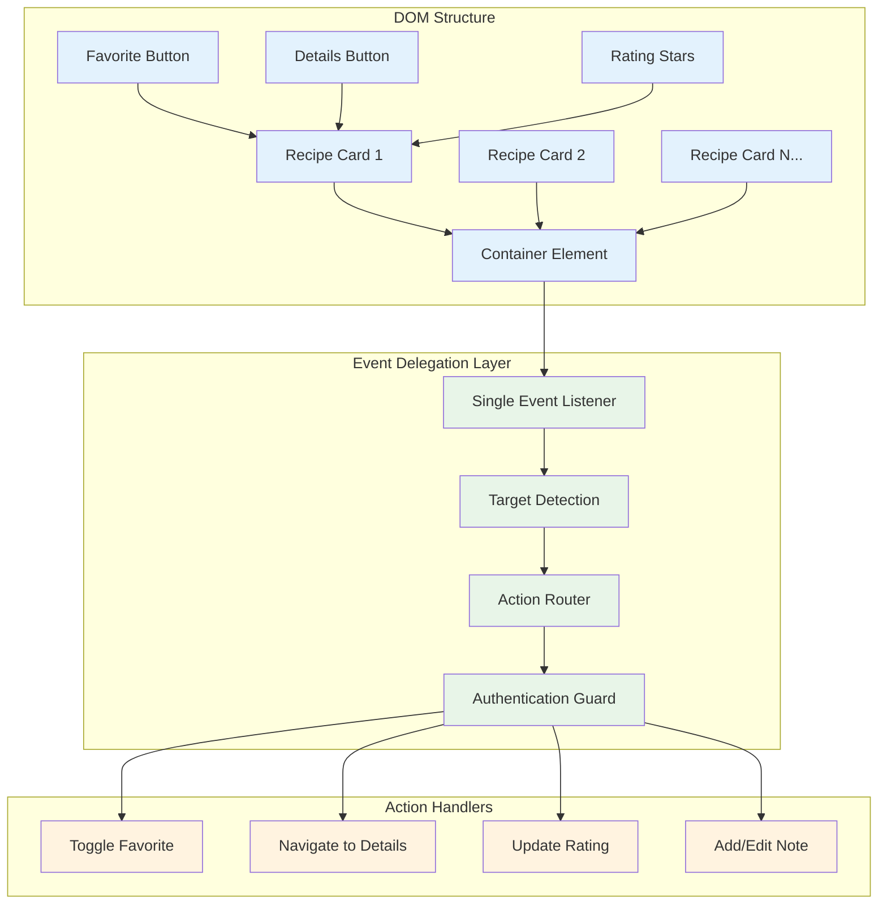
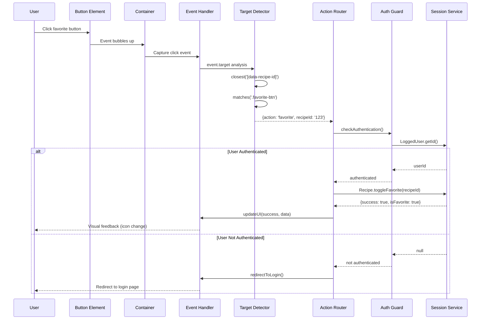
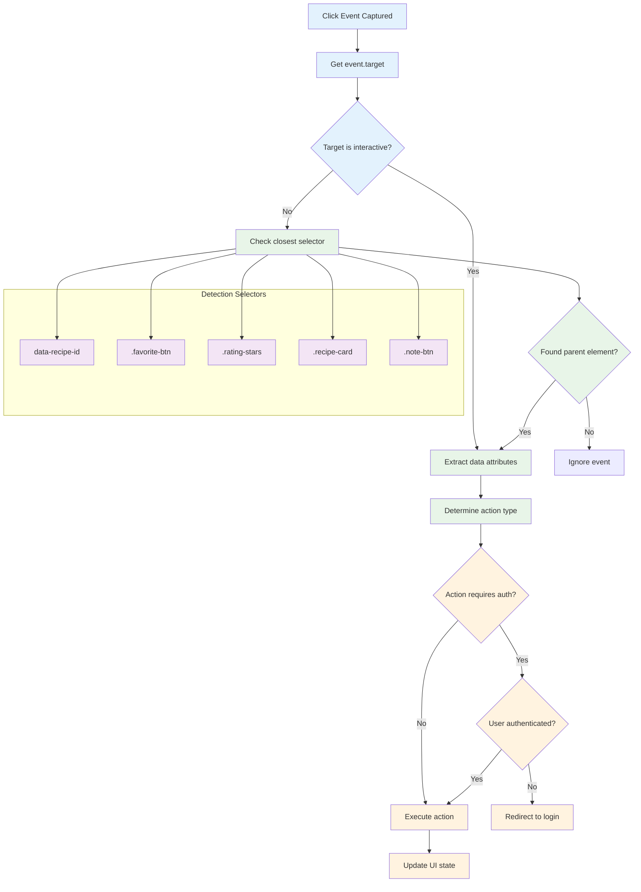
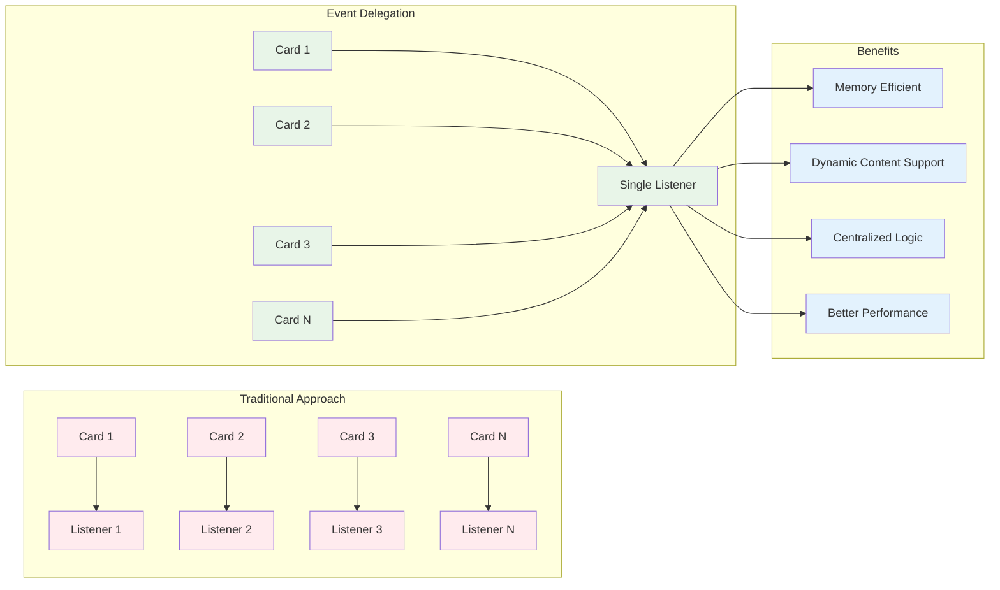

# Event Delegation Pattern - PGRC

## Event Delegation Architecture

```mermaid
graph TB
    subgraph "DOM Structure"
        CONTAINER[Container Element]
        CARD1[Recipe Card 1]
        CARD2[Recipe Card 2]
        CARD3[Recipe Card N...]
        BTN1[Favorite Button]
        BTN2[Details Button]
        BTN3[Rating Stars]
    end
    
    subgraph "Event Delegation Layer"
        LISTENER[Single Event Listener]
        DETECTOR[Target Detection]
        ROUTER[Action Router]
        GUARD[Authentication Guard]
    end
    
    subgraph "Action Handlers"
        FAV[Toggle Favorite]
        NAV[Navigate to Details]
        RATE[Update Rating]
        NOTE[Add/Edit Note]
    end
    
    CONTAINER --> LISTENER
    CARD1 --> CONTAINER
    CARD2 --> CONTAINER
    CARD3 --> CONTAINER
    BTN1 --> CARD1
    BTN2 --> CARD1
    BTN3 --> CARD1
    
    LISTENER --> DETECTOR
    DETECTOR --> ROUTER
    ROUTER --> GUARD
    
    GUARD --> FAV
    GUARD --> NAV
    GUARD --> RATE
    GUARD --> NOTE
    
    classDef dom fill:#e3f2fd
    classDef delegation fill:#e8f5e8
    classDef action fill:#fff3e0
    
    class CONTAINER,CARD1,CARD2,CARD3,BTN1,BTN2,BTN3 dom
    class LISTENER,DETECTOR,ROUTER,GUARD delegation
    class FAV,NAV,RATE,NOTE action
```

## Event Flow Sequence

```mermaid
sequenceDiagram
    participant USER as User
    participant BTN as Button Element
    participant CONTAINER as Container
    participant HANDLER as Event Handler
    participant DETECTOR as Target Detector
    participant ROUTER as Action Router
    participant AUTH as Auth Guard
    participant SESSION as Session Service
    
    USER->>BTN: Click favorite button
    BTN->>CONTAINER: Event bubbles up
    CONTAINER->>HANDLER: Capture click event
    HANDLER->>DETECTOR: event.target analysis
    DETECTOR->>DETECTOR: closest('[data-recipe-id]')
    DETECTOR->>DETECTOR: matches('.favorite-btn')
    DETECTOR-->>ROUTER: {action: 'favorite', recipeId: '123'}
    
    ROUTER->>AUTH: checkAuthentication()
    AUTH->>SESSION: LoggedUser.getId()
    
    alt User Authenticated
        SESSION-->>AUTH: userId
        AUTH-->>ROUTER: authenticated
        ROUTER->>SESSION: Recipe.toggleFavorite(recipeId)
        SESSION-->>ROUTER: {success: true, isFavorite: true}
        ROUTER->>HANDLER: updateUI(success, data)
        HANDLER-->>USER: Visual feedback (icon change)
    else User Not Authenticated
        SESSION-->>AUTH: null
        AUTH-->>ROUTER: not authenticated
        ROUTER->>HANDLER: redirectToLogin()
        HANDLER-->>USER: Redirect to login page
    end
```

## Target Detection Strategy

```mermaid
flowchart TD
    A[Click Event Captured] --> B[Get event.target]
    B --> C{Target is interactive?}
    C -->|No| D[Check closest selector]
    C -->|Yes| E[Extract data attributes]
    D --> F{Found parent element?}
    F -->|No| G[Ignore event]
    F -->|Yes| E
    E --> H[Determine action type]
    H --> I{Action requires auth?}
    I -->|No| J[Execute action]
    I -->|Yes| K{User authenticated?}
    K -->|No| L[Redirect to login]
    K -->|Yes| J
    J --> M[Update UI state]
    
    subgraph "Detection Selectors"
        S1[data-recipe-id]
        S2[.favorite-btn]
        S3[.rating-stars]
        S4[.recipe-card]
        S5[.note-btn]
    end
    
    D --> S1
    D --> S2
    D --> S3
    D --> S4
    D --> S5
    
    classDef event fill:#e3f2fd
    classDef detection fill:#e8f5e8
    classDef action fill:#fff3e0
    classDef selector fill:#f3e5f5
    
    class A,B,C event
    class D,E,F,H detection
    class I,J,K,L,M action
    class S1,S2,S3,S4,S5 selector
```

## Performance Benefits Visualization

```mermaid
graph LR
    subgraph "Traditional Approach"
        T1[Card 1] --> TL1[Listener 1]
        T2[Card 2] --> TL2[Listener 2]
        T3[Card 3] --> TL3[Listener 3]
        T4[Card N] --> TLN[Listener N]
    end
    
    subgraph "Event Delegation"
        D1[Card 1]
        D2[Card 2]
        D3[Card 3]
        D4[Card N]
        DL[Single Listener]
    end
    
    subgraph "Benefits"
        B1[Memory Efficient]
        B2[Dynamic Content Support]
        B3[Centralized Logic]
        B4[Better Performance]
    end
    
    D1 --> DL
    D2 --> DL
    D3 --> DL
    D4 --> DL
    
    DL --> B1
    DL --> B2
    DL --> B3
    DL --> B4
    
    classDef traditional fill:#ffebee
    classDef delegation fill:#e8f5e8
    classDef benefit fill:#e3f2fd
    
    class T1,T2,T3,T4,TL1,TL2,TL3,TLN traditional
    class D1,D2,D3,D4,DL delegation
    class B1,B2,B3,B4 benefit
```