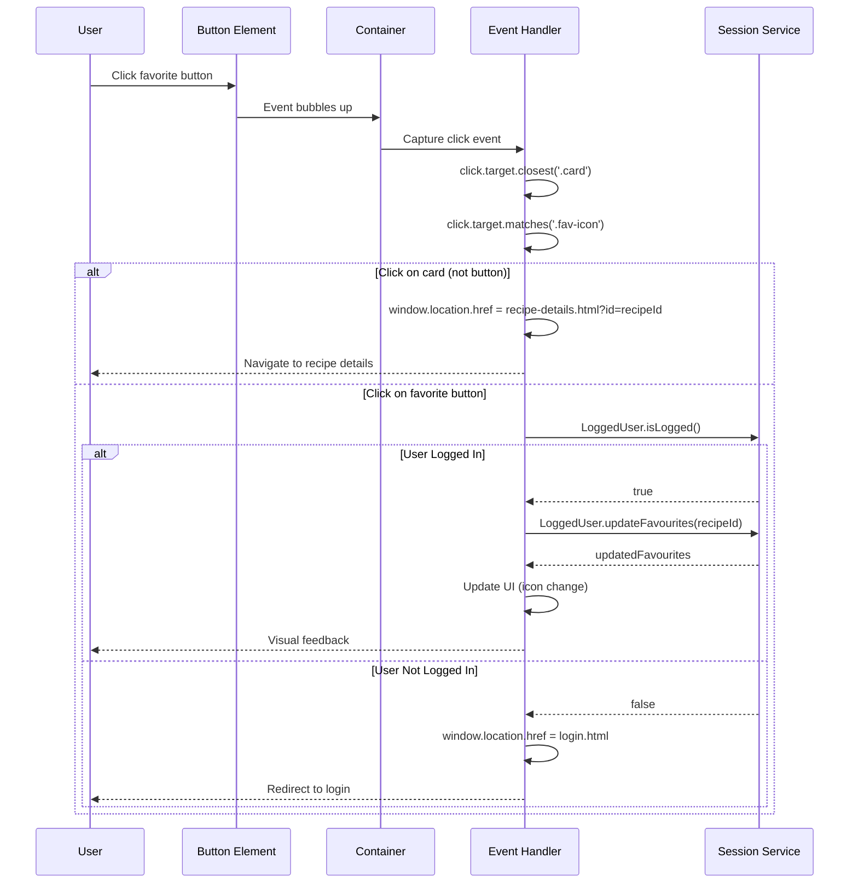
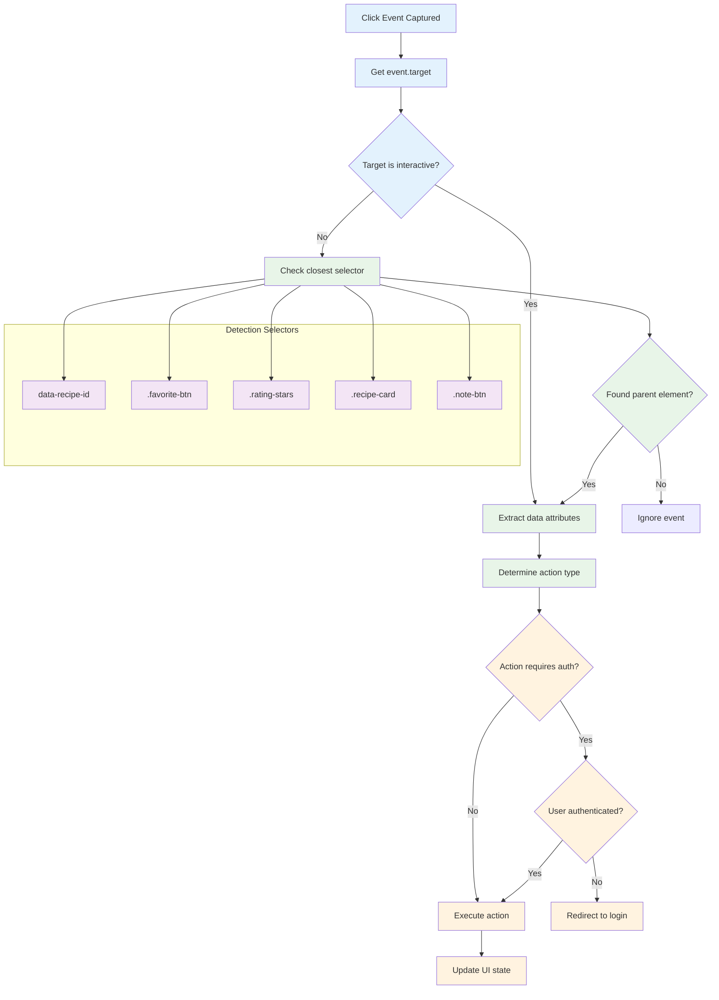

# Event Delegation Pattern - PGRC

## Event Flow Sequence

```mermaid
sequenceDiagram
    participant USER as User
    participant BTN as Button Element
    participant CONTAINER as Container
    participant HANDLER as Event Handler
    participant SESSION as Session Service
    
    USER->>BTN: Click favorite button
    BTN->>CONTAINER: Event bubbles up
    CONTAINER->>HANDLER: Capture click event
    HANDLER->>HANDLER: click.target.closest('.card')
    HANDLER->>HANDLER: click.target.matches('.fav-icon')
    
    alt Click on card (not button)
        HANDLER->>HANDLER: window.location.href = recipe-details.html?id=recipeId
        HANDLER-->>USER: Navigate to recipe details
    else Click on favorite button
        HANDLER->>SESSION: LoggedUser.isLogged()
        alt User Logged In
            SESSION-->>HANDLER: true
            HANDLER->>SESSION: LoggedUser.updateFavourites(recipeId)
            SESSION-->>HANDLER: updatedFavourites
            HANDLER->>HANDLER: Update UI (icon change)
            HANDLER-->>USER: Visual feedback
        else User Not Logged In
            SESSION-->>HANDLER: false
            HANDLER->>HANDLER: window.location.href = login.html
            HANDLER-->>USER: Redirect to login
        end
    end
```

## Target Detection Strategy

```mermaid
flowchart TD
    A[Click Event Captured] --> B[Get event.target]
    B --> C{Target is interactive?}
    C -->|No| D[Check closest selector]
    C -->|Yes| E[Extract data attributes]
    D --> F{Found parent element?}
    F -->|No| G[Ignore event]
    F -->|Yes| E
    E --> H[Determine action type]
    H --> I{Action requires auth?}
    I -->|No| J[Execute action]
    I -->|Yes| K{User authenticated?}
    K -->|No| L[Redirect to login]
    K -->|Yes| J
    J --> M[Update UI state]
    
    subgraph "Detection Selectors"
        S1[data-recipe-id]
        S2[.favorite-btn]
        S3[.rating-stars]
        S4[.recipe-card]
        S5[.note-btn]
    end
    
    D --> S1
    D --> S2
    D --> S3
    D --> S4
    D --> S5
    
    classDef event fill:#e3f2fd
    classDef detection fill:#e8f5e8
    classDef action fill:#fff3e0
    classDef selector fill:#f3e5f5
    
    class A,B,C event
    class D,E,F,H detection
    class I,J,K,L,M action
    class S1,S2,S3,S4,S5 selector
```

