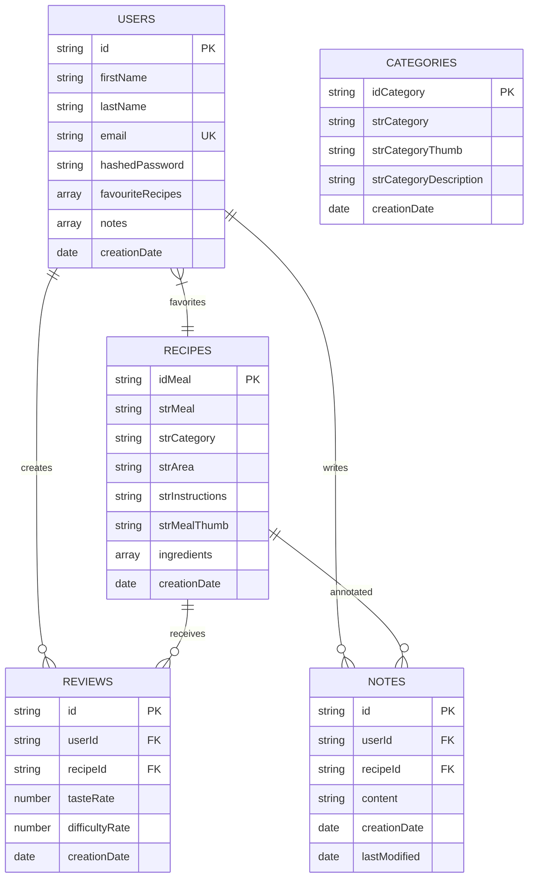
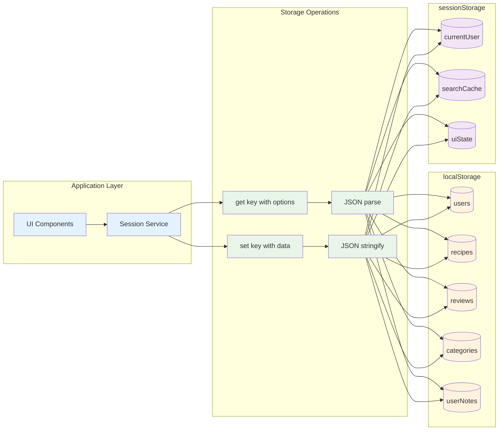
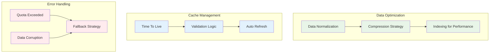

# Database Schema localStorage - PGRC

## Storage Structure Overview



## localStorage Keys Structure

```
localStorage
├── users                    # Array of User objects
├── recipes                  # Array of FullRecipe objects  
├── reviews                  # Array of Review objects
├── categories               # Array of Category objects
└── userNotes               # Array of Note objects

sessionStorage
├── currentUser             # Current logged user ID
├── searchCache             # Temporary search results
└── uiState                 # Temporary UI state
```

## Data Flow Diagram



## Storage Optimization Strategy

