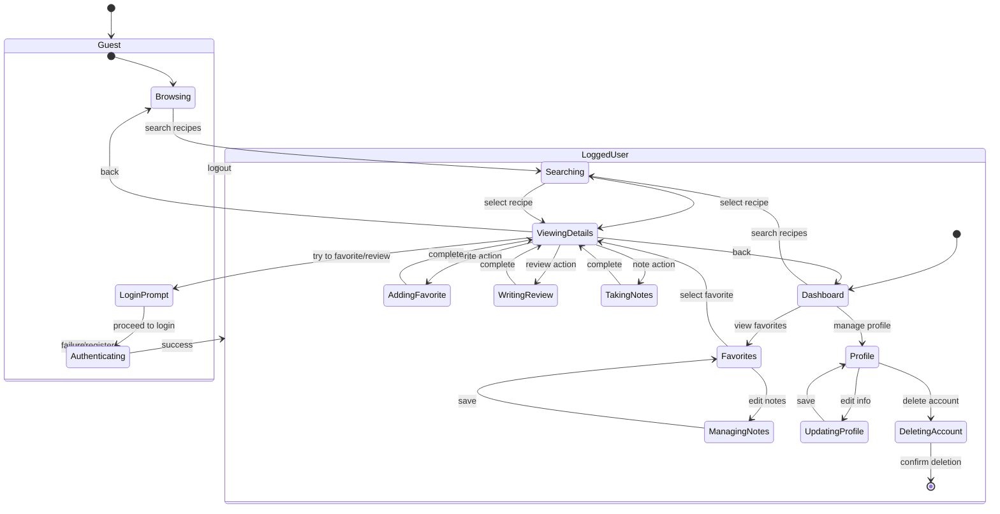
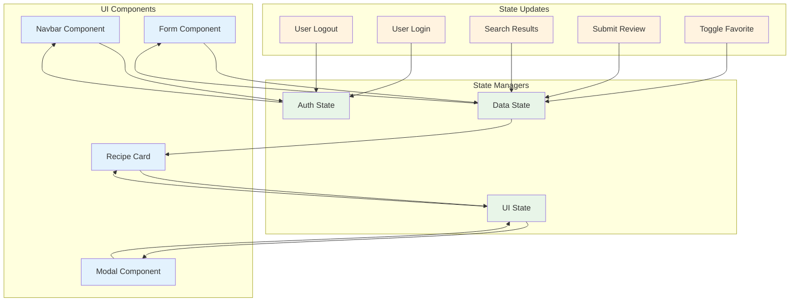
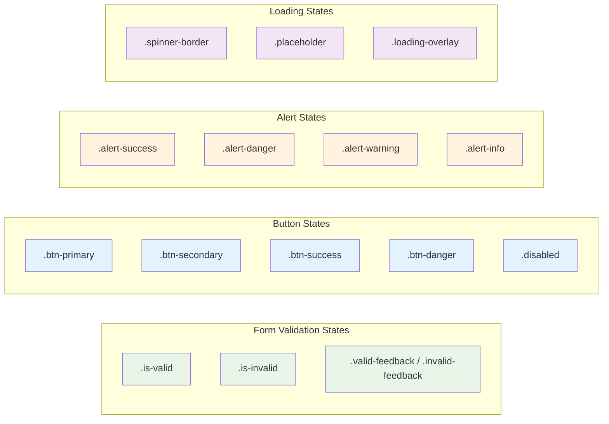
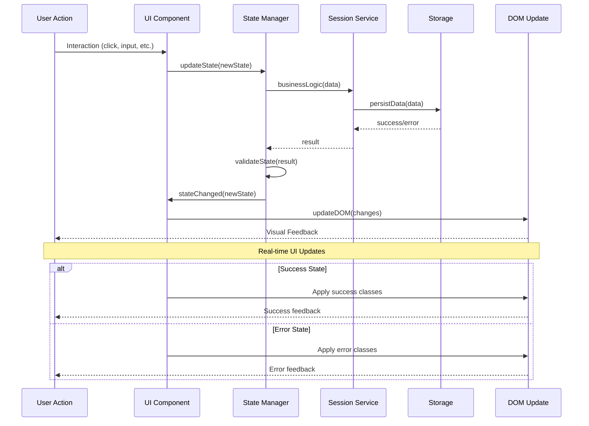

# UI State Management - PGRC

## State Management Architecture

```mermaid
stateDiagram-v2
    [*] --> Guest
    Guest --> Authenticating : login/register
    Authenticating --> LoggedUser : success
    Authenticating --> Guest : failure
    LoggedUser --> Guest : logout
    
    state Guest {
        [*] --> Browsing
        Browsing --> Searching : search recipes
        Searching --> ViewingDetails : select recipe
        ViewingDetails --> Browsing : back
        ViewingDetails --> LoginPrompt : try to favorite/review
        LoginPrompt --> Authenticating : proceed to login
    }
    
    state LoggedUser {
        [*] --> Dashboard
        Dashboard --> Searching : search recipes
        Dashboard --> Favorites : view favorites
        Dashboard --> Profile : manage profile
        
        Searching --> ViewingDetails : select recipe
        ViewingDetails --> Dashboard : back
        ViewingDetails --> AddingFavorite : favorite action
        ViewingDetails --> WritingReview : review action
        ViewingDetails --> TakingNotes : note action
        
        AddingFavorite --> ViewingDetails : complete
        WritingReview --> ViewingDetails : complete
        TakingNotes --> ViewingDetails : complete
        
        Favorites --> ViewingDetails : select favorite
        Favorites --> ManagingNotes : edit notes
        ManagingNotes --> Favorites : save
        
        Profile --> UpdatingProfile : edit info
        Profile --> DeletingAccount : delete account
        UpdatingProfile --> Profile : save
        DeletingAccount --> [*] : confirm deletion
    }
```

## Component State Flow

```mermaid
flowchart TD
    subgraph "UI Components"
        NAV[Navbar Component]
        CARD[Recipe Card]
        MODAL[Modal Component]
        FORM[Form Component]
    end
    
    subgraph "State Managers"
        AUTH[Auth State]
        UI_STATE[UI State]
        DATA_STATE[Data State]
    end
    
    subgraph "State Updates"
        LOGIN[User Login]
        LOGOUT[User Logout]
        FAVORITE[Toggle Favorite]
        REVIEW[Submit Review]
        SEARCH[Search Results]
    end
    
    NAV --> AUTH
    CARD --> UI_STATE
    MODAL --> UI_STATE
    FORM --> DATA_STATE
    
    LOGIN --> AUTH
    LOGOUT --> AUTH
    FAVORITE --> DATA_STATE
    REVIEW --> DATA_STATE
    SEARCH --> DATA_STATE
    
    AUTH --> NAV
    UI_STATE --> CARD
    UI_STATE --> MODAL
    DATA_STATE --> CARD
    DATA_STATE --> FORM
    
    classDef component fill:#e3f2fd
    classDef state fill:#e8f5e8
    classDef update fill:#fff3e0
    
    class NAV,CARD,MODAL,FORM component
    class AUTH,UI_STATE,DATA_STATE state
    class LOGIN,LOGOUT,FAVORITE,REVIEW,SEARCH update
```

## Bootstrap CSS State Classes

```mermaid
graph LR
    subgraph "Form Validation States"
        VALID[.is-valid]
        INVALID[.is-invalid]
        FEEDBACK[.valid-feedback / .invalid-feedback]
    end
    
    subgraph "Button States"
        BTN_PRIMARY[.btn-primary]
        BTN_SECONDARY[.btn-secondary]
        BTN_SUCCESS[.btn-success]
        BTN_DANGER[.btn-danger]
        BTN_DISABLED[.disabled]
    end
    
    subgraph "Alert States"
        ALERT_SUCCESS[.alert-success]
        ALERT_DANGER[.alert-danger]
        ALERT_WARNING[.alert-warning]
        ALERT_INFO[.alert-info]
    end
    
    subgraph "Loading States"
        SPINNER[.spinner-border]
        PLACEHOLDER[.placeholder]
        LOADING[.loading-overlay]
    end
    
    classDef validation fill:#e8f5e8
    classDef button fill:#e3f2fd
    classDef alert fill:#fff3e0
    classDef loading fill:#f3e5f5
    
    class VALID,INVALID,FEEDBACK validation
    class BTN_PRIMARY,BTN_SECONDARY,BTN_SUCCESS,BTN_DANGER,BTN_DISABLED button
    class ALERT_SUCCESS,ALERT_DANGER,ALERT_WARNING,ALERT_INFO alert
    class SPINNER,PLACEHOLDER,LOADING loading
```

## UI Update Sequence

```mermaid
sequenceDiagram
    participant USER as User Action
    participant UI as UI Component
    participant STATE as State Manager
    participant SESSION as Session Service
    participant STORAGE as Storage
    participant DOM as DOM Update
    
    USER->>UI: Interaction (click, input, etc.)
    UI->>STATE: updateState(newState)
    STATE->>SESSION: businessLogic(data)
    SESSION->>STORAGE: persistData(data)
    STORAGE-->>SESSION: success/error
    SESSION-->>STATE: result
    STATE->>STATE: validateState(result)
    STATE->>UI: stateChanged(newState)
    UI->>DOM: updateDOM(changes)
    DOM-->>USER: Visual Feedback
    
    Note over USER,DOM: Real-time UI Updates
    
    alt Success State
        UI->>DOM: Apply success classes
        DOM-->>USER: Success feedback
    else Error State
        UI->>DOM: Apply error classes
        DOM-->>USER: Error feedback
    end
```