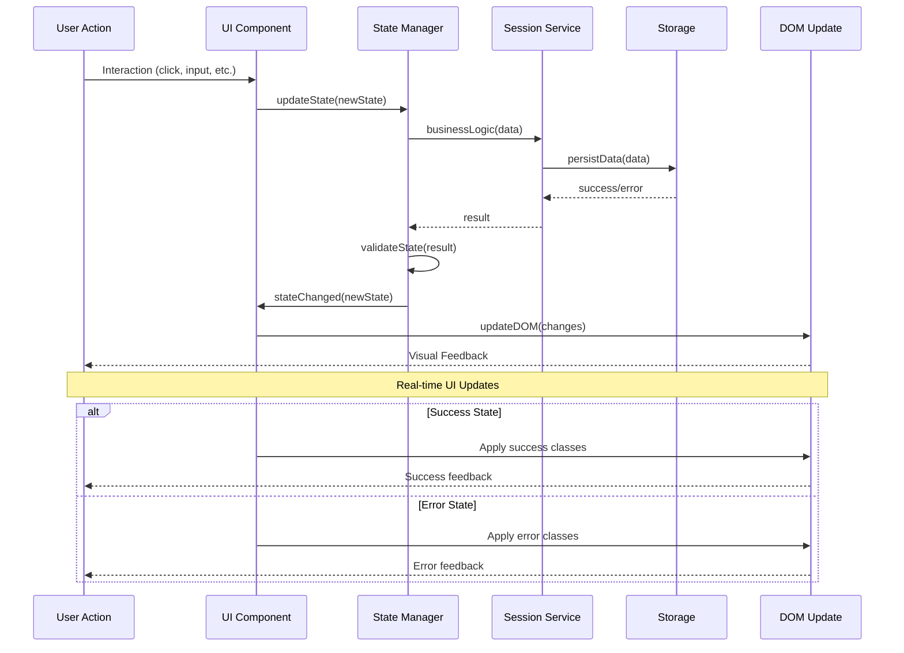

# UI State Management - PGRC

## UI Update Sequence

```mermaid
sequenceDiagram
    participant USER as User Action
    participant UI as UI Component
    participant STATE as State Manager
    participant SESSION as Session Service
    participant STORAGE as Storage
    participant DOM as DOM Update
    
    USER->>UI: Interaction (click, input, etc.)
    UI->>STATE: updateState(newState)
    STATE->>SESSION: businessLogic(data)
    SESSION->>STORAGE: persistData(data)
    STORAGE-->>SESSION: success/error
    SESSION-->>STATE: result
    STATE->>STATE: validateState(result)
    STATE->>UI: stateChanged(newState)
    UI->>DOM: updateDOM(changes)
    DOM-->>USER: Visual Feedback
    
    Note over USER,DOM: Real-time UI Updates
    
    alt Success State
        UI->>DOM: Apply success classes
        DOM-->>USER: Success feedback
    else Error State
        UI->>DOM: Apply error classes
        DOM-->>USER: Error feedback
    end
```