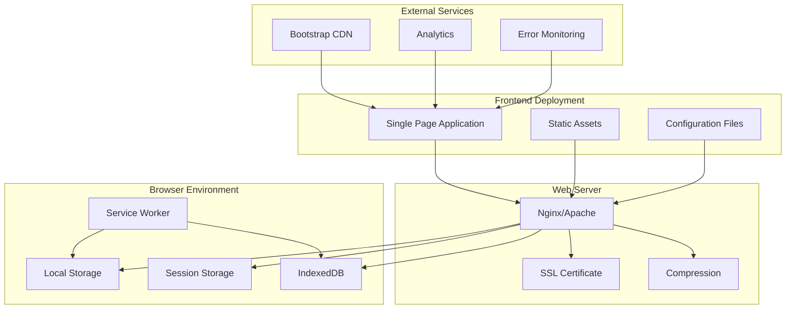
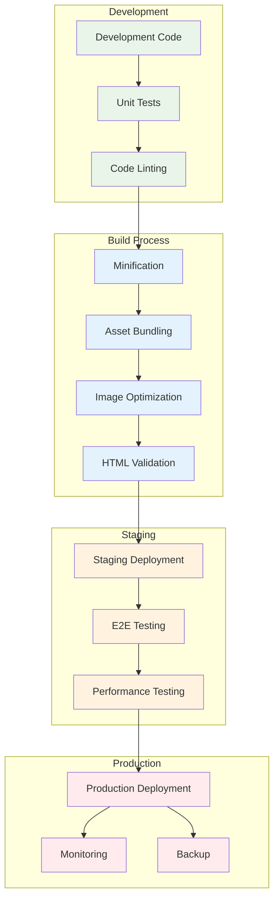
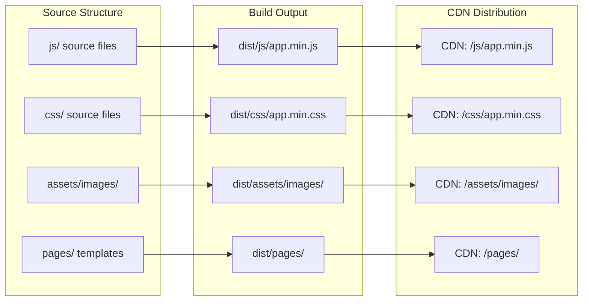
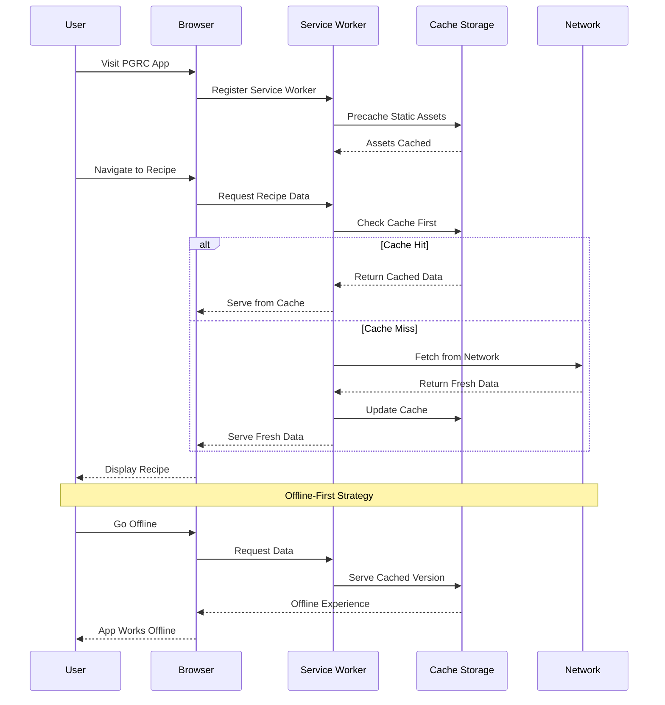
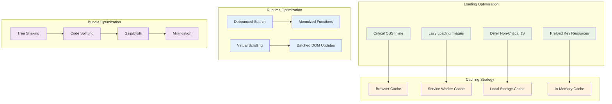

# Deployment Architecture - PGRC

## Deployment Environment

```mermaid
graph TB
    subgraph "Frontend Deployment"
        SPA[Single Page Application]
        STATIC[Static Assets]
        CONFIG[Configuration Files]
    end
    
    subgraph "Web Server"
        NGINX[Nginx/Apache]
        SSL[SSL Certificate]
        GZIP[Compression]
    end
    
    subgraph "Browser Environment"
        LOCALSTORAGE[Local Storage]
        SESSIONSTORAGE[Session Storage]
        INDEXEDDB[IndexedDB]
        SERVICEWORKER[Service Worker]
    end
    
    subgraph "External Services"
        CDN[Bootstrap CDN]
        ANALYTICS[Analytics]
        MONITORING[Error Monitoring]
    end
    
    SPA --> NGINX
    STATIC --> NGINX
    CONFIG --> NGINX
    
    NGINX --> SSL
    NGINX --> GZIP
    
    NGINX --> LOCALSTORAGE
    NGINX --> SESSIONSTORAGE
    NGINX --> INDEXEDDB
    
    CDN --> SPA
    ANALYTICS --> SPA
    MONITORING --> SPA
    
    SERVICEWORKER --> LOCALSTORAGE
    SERVICEWORKER --> INDEXEDDB
```

## Build and Deploy Process

```mermaid
flowchart TD
    subgraph "Development"
        DEV[Development Code]
        TEST[Unit Tests]
        LINT[Code Linting]
    end
    
    subgraph "Build Process"
        MINIFY[Minification]
        BUNDLE[Asset Bundling]
        OPTIMIZE[Image Optimization]
        VALIDATE[HTML Validation]
    end
    
    subgraph "Staging"
        STAGE_DEPLOY[Staging Deployment]
        E2E[E2E Testing]
        PERF[Performance Testing]
    end
    
    subgraph "Production"
        PROD_DEPLOY[Production Deployment]
        MONITOR[Monitoring]
        BACKUP[Backup]
    end
    
    DEV --> TEST
    TEST --> LINT
    LINT --> MINIFY
    
    MINIFY --> BUNDLE
    BUNDLE --> OPTIMIZE
    OPTIMIZE --> VALIDATE
    
    VALIDATE --> STAGE_DEPLOY
    STAGE_DEPLOY --> E2E
    E2E --> PERF
    
    PERF --> PROD_DEPLOY
    PROD_DEPLOY --> MONITOR
    PROD_DEPLOY --> BACKUP
    
    classDef dev fill:#e8f5e8
    classDef build fill:#e3f2fd
    classDef staging fill:#fff3e0
    classDef prod fill:#ffebee
    
    class DEV,TEST,LINT dev
    class MINIFY,BUNDLE,OPTIMIZE,VALIDATE build
    class STAGE_DEPLOY,E2E,PERF staging
    class PROD_DEPLOY,MONITOR,BACKUP prod
```

## Static Asset Structure

```mermaid
graph LR
    subgraph "Source Structure"
        JS_SRC[js/ source files]
        CSS_SRC[css/ source files]
        IMG_SRC[assets/images/]
        HTML_SRC[pages/ templates]
    end
    
    subgraph "Build Output"
        JS_DIST[dist/js/app.min.js]
        CSS_DIST[dist/css/app.min.css]
        IMG_DIST[dist/assets/images/]
        HTML_DIST[dist/pages/]
    end
    
    subgraph "CDN Distribution"
        JS_CDN[CDN: /js/app.min.js]
        CSS_CDN[CDN: /css/app.min.css]
        IMG_CDN[CDN: /assets/images/]
        HTML_CDN[CDN: /pages/]
    end
    
    JS_SRC --> JS_DIST
    CSS_SRC --> CSS_DIST
    IMG_SRC --> IMG_DIST
    HTML_SRC --> HTML_DIST
    
    JS_DIST --> JS_CDN
    CSS_DIST --> CSS_CDN
    IMG_DIST --> IMG_CDN
    HTML_DIST --> HTML_CDN
```

## Progressive Web App (PWA) Implementation

```mermaid
sequenceDiagram
    participant USER as User
    participant BROWSER as Browser
    participant SW as Service Worker
    participant CACHE as Cache Storage
    participant NETWORK as Network
    
    USER->>BROWSER: Visit PGRC App
    BROWSER->>SW: Register Service Worker
    SW->>CACHE: Precache Static Assets
    CACHE-->>SW: Assets Cached
    
    USER->>BROWSER: Navigate to Recipe
    BROWSER->>SW: Request Recipe Data
    SW->>CACHE: Check Cache First
    
    alt Cache Hit
        CACHE-->>SW: Return Cached Data
        SW-->>BROWSER: Serve from Cache
    else Cache Miss
        SW->>NETWORK: Fetch from Network
        NETWORK-->>SW: Return Fresh Data
        SW->>CACHE: Update Cache
        SW-->>BROWSER: Serve Fresh Data
    end
    
    BROWSER-->>USER: Display Recipe
    
    Note over USER,NETWORK: Offline-First Strategy
    
    USER->>BROWSER: Go Offline
    BROWSER->>SW: Request Data
    SW->>CACHE: Serve Cached Version
    CACHE-->>BROWSER: Offline Experience
    BROWSER-->>USER: App Works Offline
```

## Performance Optimization

```mermaid
graph TD
    subgraph "Loading Optimization"
        CRITICAL[Critical CSS Inline]
        LAZY[Lazy Loading Images]
        PRELOAD[Preload Key Resources]
        DEFER[Defer Non-Critical JS]
    end
    
    subgraph "Runtime Optimization"
        DEBOUNCE[Debounced Search]
        VIRTUAL[Virtual Scrolling]
        MEMOIZE[Memoized Functions]
        BATCH[Batched DOM Updates]
    end
    
    subgraph "Caching Strategy"
        BROWSER_CACHE[Browser Cache]
        SERVICE_WORKER[Service Worker Cache]
        LOCAL_CACHE[Local Storage Cache]
        MEMORY_CACHE[In-Memory Cache]
    end
    
    subgraph "Bundle Optimization"
        TREE_SHAKE[Tree Shaking]
        CODE_SPLIT[Code Splitting]
        COMPRESSION[Gzip/Brotli]
        MINIFICATION[Minification]
    end
    
    CRITICAL --> BROWSER_CACHE
    LAZY --> SERVICE_WORKER
    PRELOAD --> MEMORY_CACHE
    DEFER --> LOCAL_CACHE
    
    DEBOUNCE --> MEMOIZE
    VIRTUAL --> BATCH
    
    TREE_SHAKE --> CODE_SPLIT
    CODE_SPLIT --> COMPRESSION
    COMPRESSION --> MINIFICATION
    
    classDef loading fill:#e8f5e8
    classDef runtime fill:#e3f2fd
    classDef caching fill:#fff3e0
    classDef bundle fill:#f3e5f5
    
    class CRITICAL,LAZY,PRELOAD,DEFER loading
    class DEBOUNCE,VIRTUAL,MEMOIZE,BATCH runtime
    class BROWSER_CACHE,SERVICE_WORKER,LOCAL_CACHE,MEMORY_CACHE caching
    class TREE_SHAKE,CODE_SPLIT,COMPRESSION,MINIFICATION bundle
```