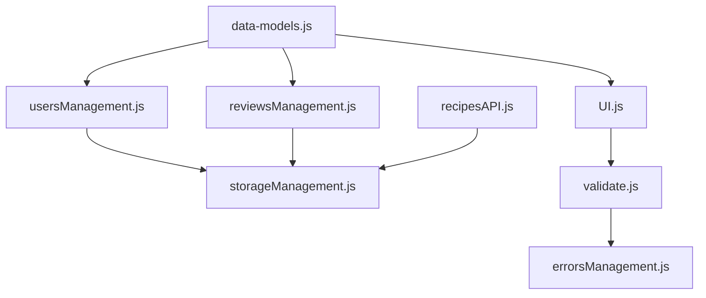
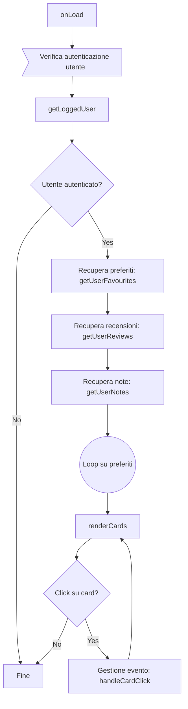
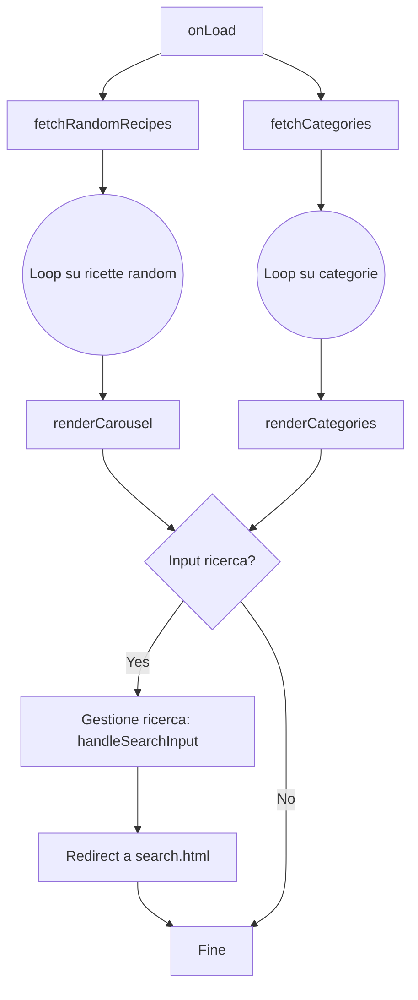
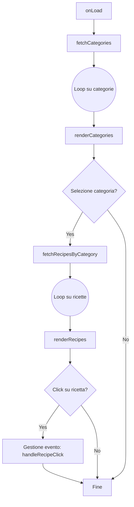
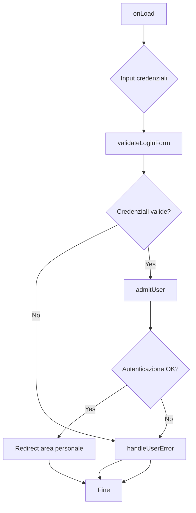
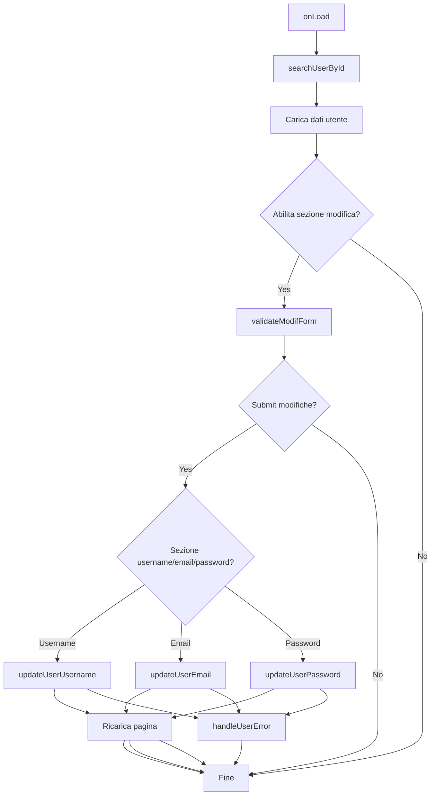
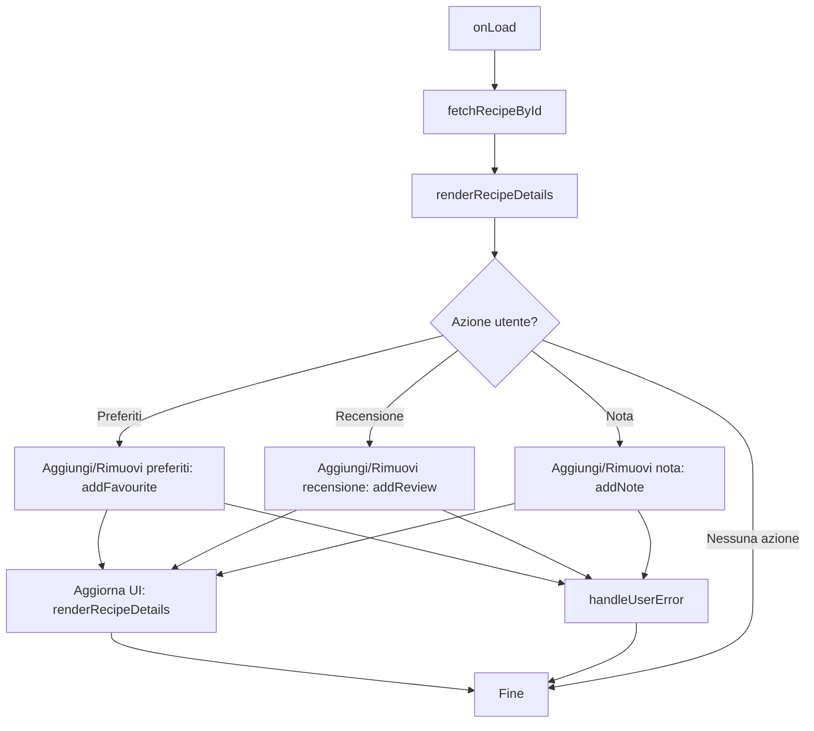
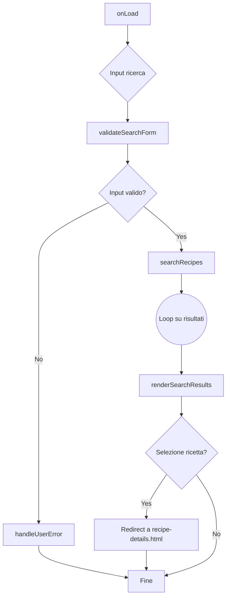
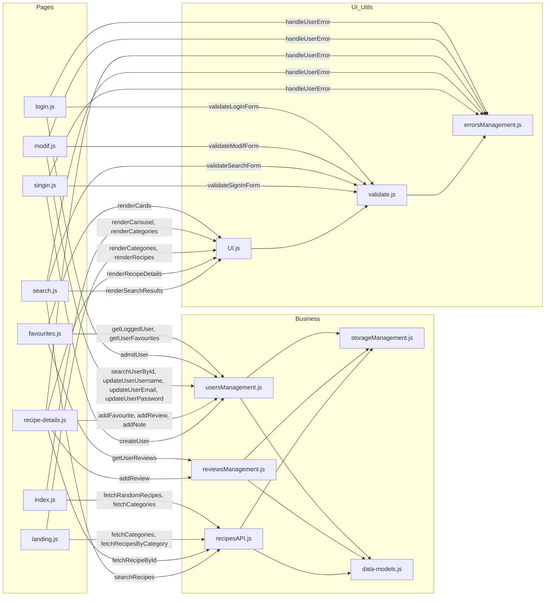

# 📚 SSRI-PWM - Schemi Tecnici Dettagliati per Script di Pagina e Moduli JS

---

## 🗂️ **Moduli Business e Utility: Dipendenze e Interazioni**


**Legenda:**  
- Le frecce indicano dipendenze dirette (import/require).
- `data-models.js` fornisce le classi dati a tutti i moduli principali.
- `usersManagement.js`, `reviewsManagement.js`, `recipesAPI.js` gestiscono la logica business e interagiscono con `storageManagement.js`.
- `UI.js` si occupa del rendering e usa la validazione.
- `validate.js` e `errorsManagement.js` sono utility trasversali.

---

## 🗂️ **Script di Pagina: Flusso Tecnico Dettagliato**

---

### 1️⃣ **favourites.js**


**Moduli usati:**  
- `usersManagement.js`, `reviewsManagement.js`, `UI.js`, `storageManagement.js`

---

### 2️⃣ **index.js**


**Moduli usati:**  
- `recipesAPI.js`, `UI.js`

---

### 3️⃣ **landing.js**


**Moduli usati:**  
- `recipesAPI.js`, `UI.js`

---

### 4️⃣ **login.js**


**Moduli usati:**  
- `usersManagement.js`, `validate.js`, `errorsManagement.js`

---

### 5️⃣ **modif.js**


**Moduli usati:**  
- `usersManagement.js`, `validate.js`, `errorsManagement.js`

---

### 6️⃣ **recipe-details.js**


**Moduli usati:**  
- `recipesAPI.js`, `usersManagement.js`, `reviewsManagement.js`, `UI.js`, `errorsManagement.js`

---

### 7️⃣ **search.js**


**Moduli usati:**  
- `recipesAPI.js`, `UI.js`, `validate.js`, `errorsManagement.js`

---

### 8️⃣ **singin.js**

```mermaid
flowchart TD
    A[onLoad]
    B{Input dati utente}
    C[validateSignInForm()]
    D{Dati validi?}
    E[createUser()]
    F{Creazione OK?}
    G[Redirect area personale]
    H[handleUserError()]
    I[Fine]

    A --> B --> C --> D
    D -- No --> H --> I
    D -- Yes --> E --> F
    F -- Yes --> G --> I
    F -- No --> H --> I
```
**Moduli usati:**  
- `usersManagement.js`, `validate.js`, `errorsManagement.js`

---

## 🗂️ **Schema di Interazione Moduli e Script di Pagina**



---

**Questi schemi documentano in modo dettagliato e tecnico il workflow e le dipendenze di ogni script di pagina e dei moduli JS principali del progetto SSRI-PWM. Puoi copiarli direttamente in un file `.md` e visualizzarli con editor compatibili con Mermaid o importarli singolarmente in draw.io.**