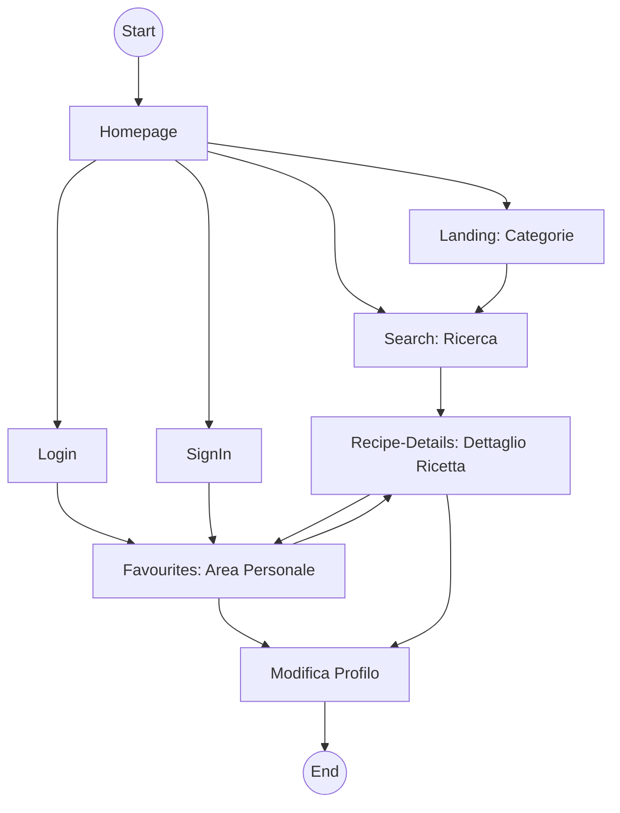
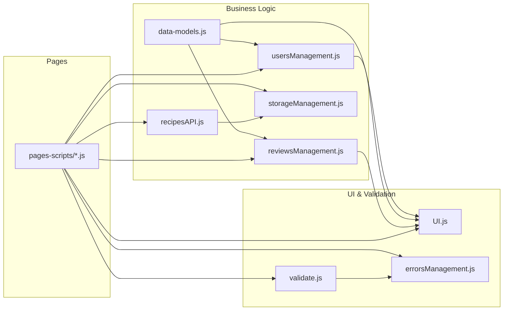
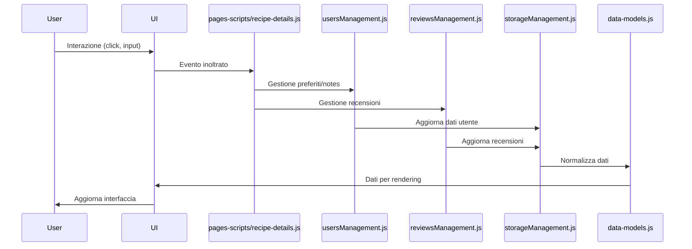
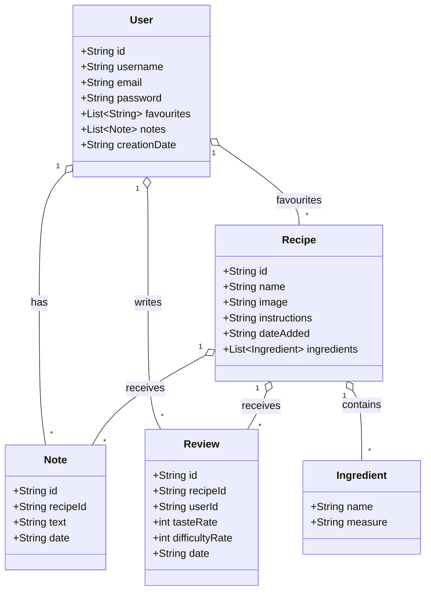
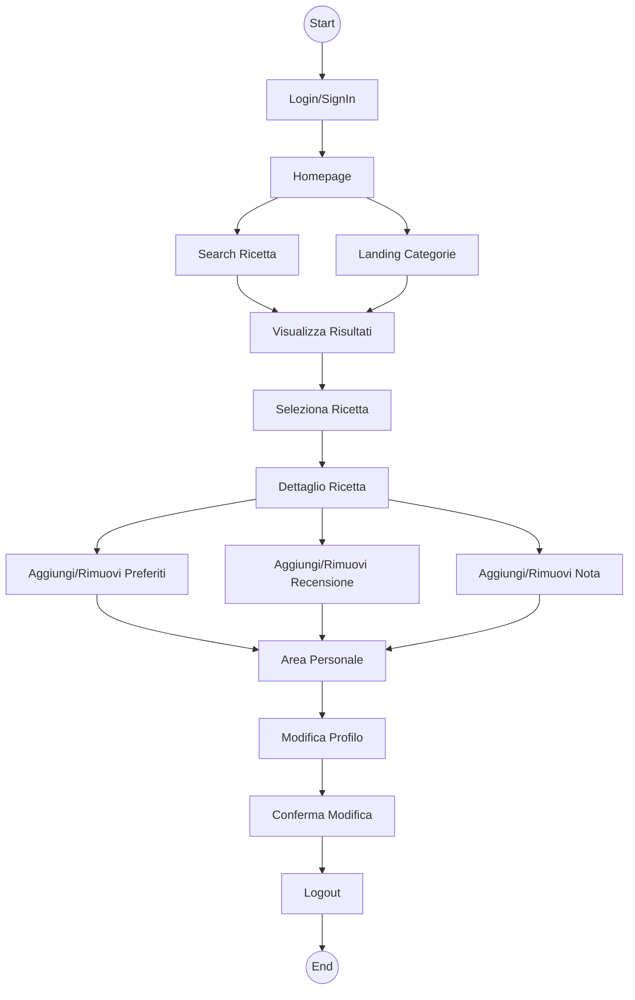

# 📊 SSRI-PWM - Schemi Visuali Avanzati (Mermaid + UML) & Flussi di Lavoro

---

## 1️⃣ **Workflow Utente (Flowchart semplificato e ordinato)**

---

## 2️⃣ **Dipendenze Moduli JS (Modular Dependency Graph ordinato)**

---

## 3️⃣ **Flusso Tecnico Ricetta/Recensione/Preferito (Sequence Diagram)**

---

## 4️⃣ **UML - Entity Relationship (Class Diagram Unificato)**

---

## 5️⃣ **Activity Diagram - Flusso Principale Utente (Sequence Diagram)**

---

**Questi schemi Mermaid e UML documentano i flussi di lavoro, le dipendenze tecniche e le relazioni tra dati del progetto SSRI-PWM. Puoi copiarli direttamente in un file `.md` e visualizzarli con editor compatibili con Mermaid o importarli singolarmente in draw.io.**